<style>
citation {
  font-size: 4px;
}
</style>

<!--  Version 1.0-0

      This version of the slides is taken directly from Mine Çetinkaya-Rundel's lecture slides
      posted on OpenIntro.org in .pptx and .gdslides format, and moved to Rmd. Originally done
      as a translation for github.com/wesleyburr/introstat_random/.
      
      A large part of the HTML/CSS formatting is janky, and could be cleaned up. Feel free to issue a 
      pull request if you love HTML and CSS and want to fix this up.
      
      - wburr, Sept 10, 2018
-->

<!-- Chapter 1.6 of version 3, Chapter 2.1 of version 4 -->
# Examining Numerical Data

## Scatterplots

**Scatterplots** are useful for visualizing the relationship between two numerical variables.

<div style="float:right; position:relative; margin-left:50px;"> 
```{r, echo=FALSE, out.width = "350px"}
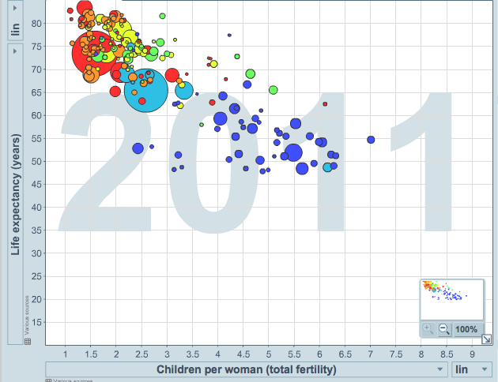
```
</div>
<span id="highlight">Do life expectancy and total fertility appear to be associated or independent?</span>

They appear to be linearly and negatively associated: as fertility increases, life expectancy decreases.

<span id="highlight">Was the relationship the same throughout the years, or did it change?</span>

The relationship changed over the years.

## Dot Plots
Useful for visualizing one numerical variable. Darker colors represent areas where there are more observations.

<div style="float:center; position:relative; left:50px; top:30px;">
```{r, out.width = "700px", echo = FALSE}
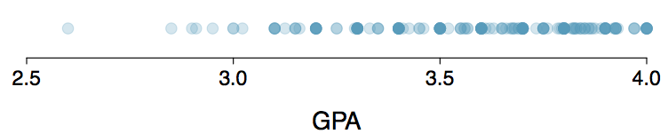
```
</div>

<br />
**How would you describe the distribution of GPAs in this data set?** 

Make sure to say something about the center, shape, and spread of the distribution.

## Dot Plots and Mean

<div style="float:center; position:relative; left:50px; top:30px;">
```{r, out.width = "700px", echo = FALSE}
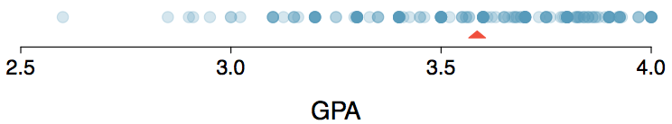
```
</div>

<br />
The **mean**, also called the average (marked with a triangle in the plot), is one way to measure the center of a **distribution** of data.

The mean GPA is 3.59.

## Mean
The **sample mean**, denoted as $\bar{x}$, can be calculated as
$$
\bar{x} = \frac{x_1 + x_2 + \cdots + x_n}{n} = \frac{1}{n} \sum_{i=1}^{n} x_i
$$
where $x_1, x_2, \cdots, x_n$ represent the $n$ observed values.

The **population mean** is also computed the same way but is denoted as $\mu$. It is often not possible to calculate $\mu$ since population data are rarely available.

The sample mean is a **sample statistic**, and serves as a **point estimate** of the population mean. This estimate may not be perfect, but if the sample is good (representative of the population), it is usually a pretty good estimate. 

## Calculating

I will never expect you to compute a mean without a calculator. In practice, we do this using
R almost always. For example,

```{r}
x <- c(1, 3, 8, 14, 21)
mean(x)
```


## Stacked Dot Plot
Higher bars represent areas where there are more observations, makes it a little easier to judge the center and the shape of the distribution.

<div style="float:center; position:relative; left:100px; top:-10px;">
```{r, out.width = "800px", echo = FALSE}
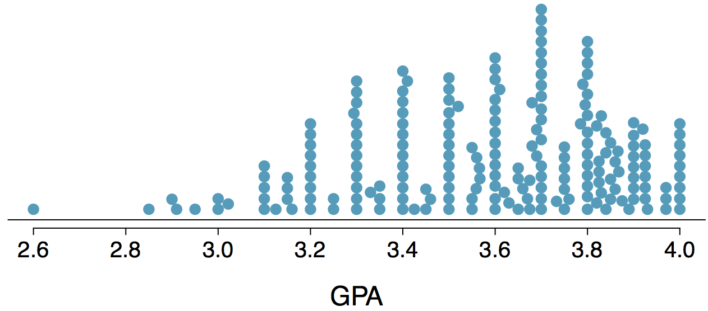
```
</div>

## Histograms $-$ Extracurricular Hours
* Histograms provide a view of the **data density**. Higher bars represent where the data are relatively more common.
* Histograms are especially convenient for describing the **shape** of the data distribution.
* The chosen **bin width** can alter the story the histogram is telling.


<div style="float:center; position:relative; left:250px; top:-10px;">
```{r, out.width = "400px", echo = FALSE}
knitr::include_graphics("fig/fig_1_6_hist.png")
```
</div>

## Bin Width
Which one(s) of these histograms are useful? Which reveal too much about the data? Which hide too much?

<center>
```{r, out.width = "750px", echo = FALSE}
knitr::include_graphics("fig/fig_1_6_hist_four.png")
```
</center>

## Shape of a Distribution: Modality
Does the histogram have a single prominent peak (**unimodal**), several prominent peaks (**bimodal/multimodal**), or no apparent peaks (**uniform**)?

<div style="float:center; position:float; left:100px; top:10px;">
```{r, out.width = "900px", echo = FALSE}
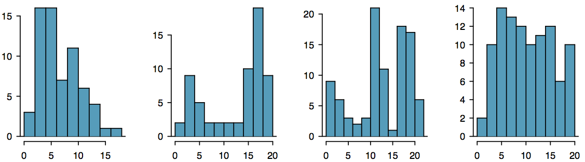
```
</div>

Note: In order to determine modality, step back and imagine a smooth curve over the histogram -- imagine that the bars are wooden blocks and you drop a limp spaghetti over them, the shape the spaghetti would take could be viewed as a smooth curve.

## Shape of a Distribution: Skewness
Is the histogram **right skewed**, **left skewed** or **symmetric**?

<div style="float:center; position:float; left:100px; top:10px;">
```{r, out.width = "700px", echo = FALSE}
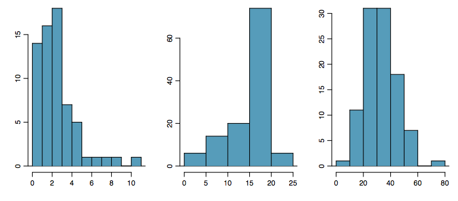
```
</div>

Histograms are said to be skewed to the side of the **long tail**.

## Shape of a Distribution: Unusual Observations
Are there any unusual observations or potential **outliers**?

<div style="float:center; position:float; left:100px; top:20px;">
```{r, out.width = "700px", echo = FALSE}
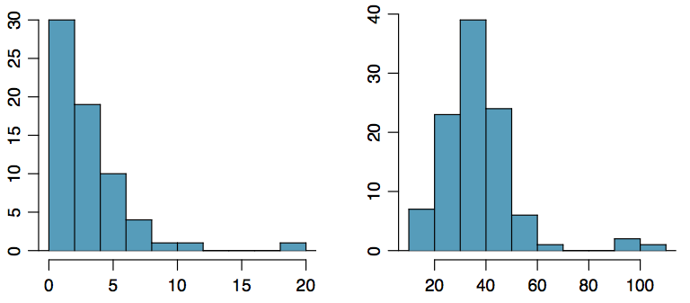
```
</div>

## Commonly observed shapes of distributions

**Modality**
<div style="width:100%; float:center;">
<div style="float:left; position:relative; left:10px; top:0px;">
```{r, out.width = "225px", echo = FALSE}
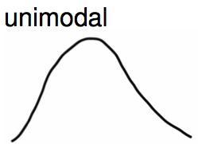
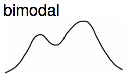
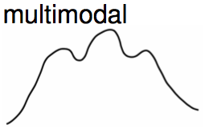
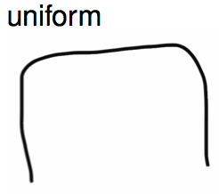
```
</div>
</div>

<br />
**Skewness**
<div style="width:100%; float:center;">
<div style="float:left; position:relative; left:10px; top:0px;">
```{r, out.width = "225px", echo = FALSE}
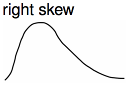
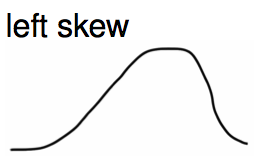
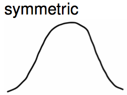
```
</div>
</div>

## Practice

Which of these variables do you expect to be uniformly distributed?

1. weights of adult females
1. salaries of a random sample of people from North Carolina
1. house prices
1. birthdays of classmates (day of the month)

## Practice

Which of these variables do you expect to be uniformly distributed?

1. weights of adult females
2. salaries of a random sample of people from North Carolina
3. house prices
4. <span id="highlight">birthdays of classmates (day of the month)</span>

## Application Activity: Shapes of Distributions

Sketch the expected distributions of the following variables:

* number of piercings
* scores on an exam
* IQ scores

Come up with a concise way (1-2 sentences) to teach someone how to determine the expected distribution of any variable.

## Are you typical?

<div style="float:left; position:relative; left:150px;">
```{r, out.width = "700px", echo = FALSE}
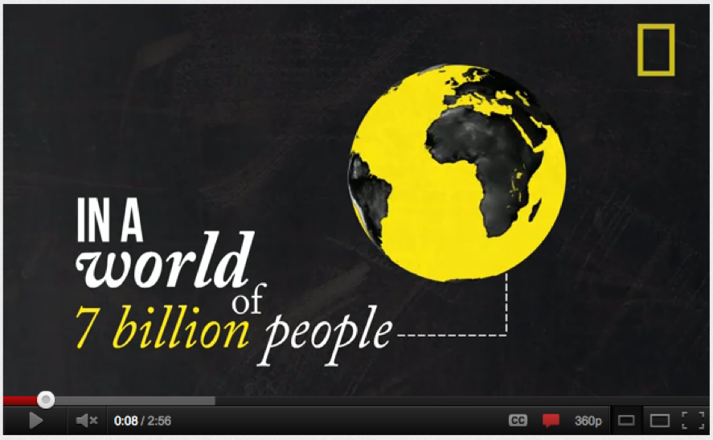
```
</div>
How useful are centers alone for conveying the true characteristics of a distribution?
 
## Variance

**Variance** is roughly the average squared deviation from the mean.

<div style="float:right; position:relative; right:10px; left:10px;">
```{r, out.width = "400px", echo = FALSE}
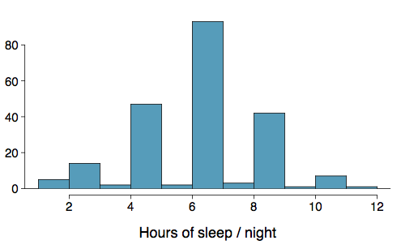
```
</div>

$$
s^2 = \frac{1}{n-1} \sum_{i=1}^{n} (x_i - \bar{x})^2
$$

* The sample mean is $\bar{x} = 6.71$, and the sample size is $n = 217$. 
* The variance of the amount of sleep students get per night can be calculated as:

$$
\begin{split}
s^2 &= \frac{1}{217 - 1} \left[ (5-6.71)^2 + (9-6.71)^2 + \cdots + (7-6.71)^2 \right] \\
    &= 4.11 \text{ hours}^2
\end{split}
$$

## Variance (continued)

Why do we use the squared deviation in the calculation of variance?

* To get rid of negatives so that observations equally distant from the mean are weighed equally.
* To weigh larger deviations more heavily.

## Standard Deviation

The **standard deviation** is the square root of the variance, and has the same units as the data.

$$
s = \sqrt{s^2}
$$

<div style="float:right; position:relative; right:10px; left:10px;">
```{r, out.width = "400px", echo = FALSE}
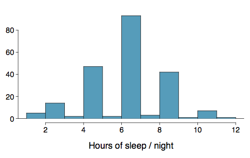
```
</div>
The standard deviation of the amount of sleep students get per night can be calculated as:
$$
s = \sqrt{4.11} = 2.03 \text{ hours}
$$
We can see that all of the data are within 3 standard deviations of the mean of $\bar{x} = 6.17$.

## Calculating

I will never expect you to compute a variance or SD without a calculator. In practice, we do this using
R almost always. For example,

```{r}
x <- c(1, 3, 8, 14, 21)
var(x)
sd(x)
sqrt(var(x))
```

## Median

The median is the value that splits the data in half when ordered in ascending order.

<center>
```{r, out.width = "150px", echo = FALSE}
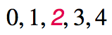
```
</center>

If there are an even number of observations, then the median is the average of the two values in the middle.

<center>
```{r, out.width = "400px", echo = FALSE}
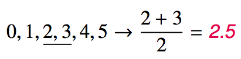
```
</center>
Since the median is the midpoint of the data, 50% of the values are below it. Hence, it is also the 50th **percentile**.

## Calculating

Medians can't really be computed with calculators, but we'll use R for this anyway ...

```{r}
x <- c(1, 3, 8, 14, 21)
median(x)
```

<!-- Slide added - percentile never defined -->
## Percentile

A **percentile** is the the smallest value from an ordered list of numbers which is greater than or equal to that percentage of list elements.

**Example**: The $42^\text{nd}$ percentile of the numbers $\{ 1, 2, 3, \cdots, 99, 100 \}$ is 42.

It can become quite complicated when there aren't an even multiple of 100 items!

## Q1, Q3 and IQR

* The 25th percentile is also called the first quartile, **Q1**.
* The 50th percentile is also called the median.
* The 75th percentile is also called the third quartile, **Q3**.

Between Q1 and Q3 is the middle 50% of the data. The range these data span is called the **interquartile range**, or the IQR.

$$
\text{IQR} = \text{Q3} - \text{Q1}
$$

## Calculating

Quantiles are actually hard to do with calculators, but R makes it easy. 

```{r}
x <- sample(1:100, size = 20, replace = TRUE)
quantile(x, probs = c(0.4, 0.6))
```

This computes the 40th and 60th percentiles. 

# Plotting as Numerical Summary 

## Box Plot
The box in a **box plot** represents the middle 50% of the data, and the thick line in the box is the median.

<center>
```{r, out.width = "400px", echo = FALSE}
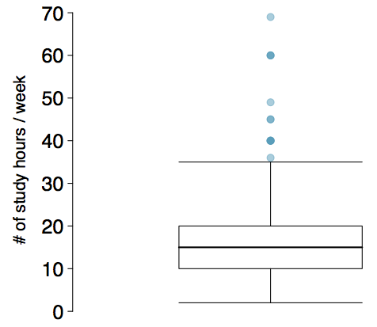
```
</center>

## Anatomy of a Box Plot
<center>
```{r, out.width = "600px", echo = FALSE}
knitr::include_graphics("fig/fig_1_6_boxplot_anatomy.png")
```
</center>

## Whiskers and Outliers

The **whiskers** of a box plot can extend up to $1.5 \times \text{IQR}$ away from the quartiles.

*	max upper whisker reach = $\text{Q3} + 1.5 \times \text{IQR}$
*	max lower whisker reach = $\text{Q1} - 1.5 \times \text{IQR}$

**Example**: IQR: 20 - 10 = 10

* max upper whisker reach = $20 + 1.5 \times 10 = 35$
* max lower whisker reach = $10 - 1.5 \times 10 = -5$

A potential outlier is defined as an observation beyond the maximum reach of the whiskers. It is an observation that appears extreme relative to the rest of the data.

## Outliers (continued)

Why is it important to look for outliers?

* Identify extreme skew in the distribution.
* Identify data collection and entry errors.
* Provide insight into interesting features of the data.

## Extreme Observations

How would sample statistics such as mean, median, SD, and IQR of household income be affected if the largest value was replaced with \$10 million? What if the smallest value was replaced with \$10 million?

<center>
```{r, out.width = "700px", echo = FALSE}
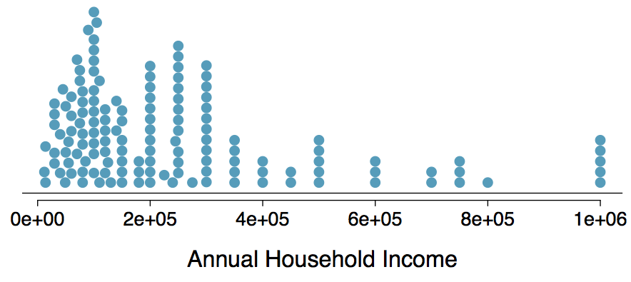
```
</center>

## Robust Statistics

<center>
```{r, out.width = "700px", echo = FALSE}
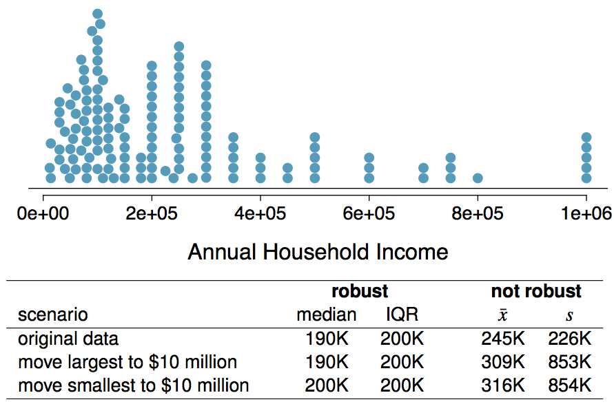
```
</center>

## Robust Statistics

Median and IQR are more robust to skewness and outliers than mean and SD. Therefore,

* for skewed distributions it is often more helpful to use median and IQR to describe the center and spread
* for symmetric distributions it is often more helpful to use the mean and SD to describe the center and spread

If you would like to estimate the typical household income for a student, would you be more interested in the mean or median income?

## Robust Statistics

Median and IQR are more robust to skewness and outliers than mean and SD. Therefore,

* for skewed distributions it is often more helpful to use median and IQR to describe the center and spread
* for symmetric distributions it is often more helpful to use the mean and SD to describe the center and spread

If you would like to estimate the typical household income for a student, would you be more interested in the mean or median income?

<span id="highlight">Median</span>

## Mean versus Median

If the distribution is symmetric, center is often defined as the mean:

* mean $\approx$ median

<div style="float:right; position:relative; right:100px; left:20px;">
```{r, out.width = "200px", echo = FALSE}
knitr::include_graphics("fig/fig_1_6_symmetric.png")
```
</div>

If the distribution is skewed or has extreme outliers, center is often defined as the median

* Right-skewed: mean > median
* Left-skewed: mean < median

<center>
```{r, out.width = "450px", echo = FALSE}
knitr::include_graphics("fig/fig_1_6_skews.png")
```
</center>

## Practice
Which is most likely true for the distribution of percentage of time actually spent taking notes in class versus on Facebook, Twitter, etc.?

<center>
```{r, out.width = "450px", echo = FALSE}
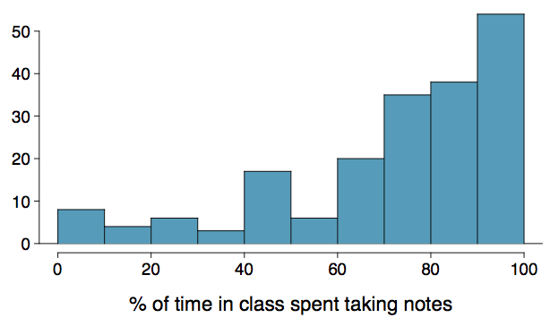
```
</center>

1. mean > median  &nbsp;&nbsp;   3. mean $\approx$ median
2. mean < median  &nbsp;&nbsp;   4. impossible to tell

<!-- div hacking is really frustrating, to get things to float properly -->
## Practice
Which is most likely true for the distribution of percentage of time actually spent taking notes in class versus on Facebook, Twitter, etc.?

If we compute, the mean = 80% and the median = 76%. So ...
<div style="position:relative; float:right;">
```{r, out.width = "450px", echo = FALSE}

```
</div>

<p>
1. mean > median  &nbsp;&nbsp;  3. mean $\approx$ median
2. <span id="highlight">mean < median</span> &nbsp;&nbsp;   4. impossible to tell
