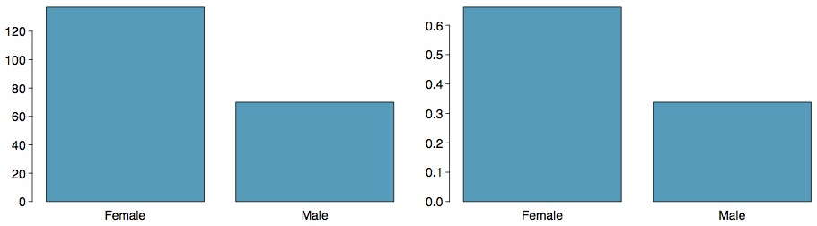
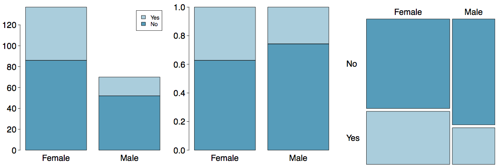
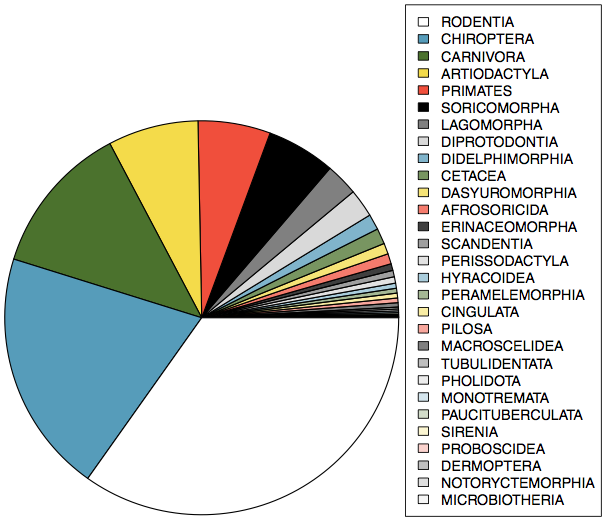
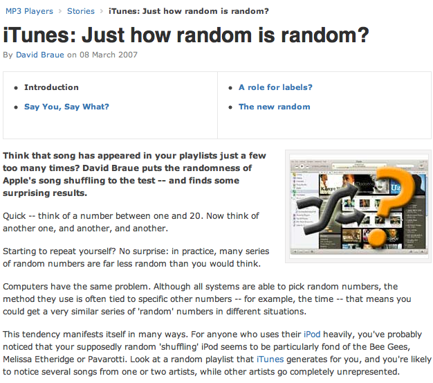

<style>
citation {
  font-size: 4px;
}
</style>

# Considering Categorical Data

## A Couple of Wrap-up Ideas

In the last lecture, we discussed numerical data, and several summary plots (histogram, boxplot).
In this little warm-up / wrap-up, we'll finish talking about data a bit more, including
**contingency tables**, which have at least one example used on the second WeBWorK Assignment.

## Contingency Tables

A table that summarizes data for two categorical variables is called a **contingency table**.

The contingency table below shows the distribution of students' genders and whether or not
they are looking for a spouse while in college.

```{r, makeContingTable1_7, echo = FALSE}
library("kableExtra")
library("knitr")
options(knitr.table.format = "html") 
dt <- data.frame("No" = c(86, 52, 138), "Yes" = c(51, 18, 69), "Total" = c(137, 70, 207))
row.names(dt) <- c("Female", "Male", "")
kable(dt, align = 'ccc') %>%
  kable_styling("striped", full_width = FALSE, position = "center", font_size = 20) %>%
  add_header_above(c(" " = 1, "looking for spouse" = 2, " " = 1)) %>%
  group_rows("gender", 1, 2) %>%
  group_rows("Total", 3, 3)
```

## Bar Plots
A **bar plot** is a common way to display a single categorical variable. A bar plot where proportions instead of frequencies are shown is called a **relative frequency bar plot**.

<center>
```{r, out.width = "600px", echo = FALSE}

```
</center>

**How are bar plots different than histograms?**
Bar plots are used for displaying distributions of categorical variables, while histograms are used for numerical variables. The x-axis in a histogram is a number line,  hence the order of the bars cannot be changed, while in a bar plot the categories can be listed in any order (though some orderings make more sense than others, especially for ordinal variables.)

## Choosing the Appropriate Proportion
Does there appear to be a relationship between gender and whether the student is looking for a spouse in college?

```{r, echo = FALSE}
kable(dt, align = 'ccc') %>%
  kable_styling("striped", full_width = FALSE, position = "center", font_size = 20) %>%
  add_header_above(c(" " = 1, "looking for spouse" = 2, " " = 1)) %>%
  group_rows("gender", 1, 2) %>%
  group_rows("Total", 3, 3)
```

To answer this question we examine the row proportions: 

* % Females looking for a spouse: 51 / 137 ~ 0.37
* % Males looking for a spouse: 18 / 70 ~ 0.26

## Segmented Bar and Mosaic Plots

What are the differences between the three visualizations shown below?

<center>
```{r, out.width = "900px", echo = FALSE}

```
</center>

## Pie Charts

Can you tell which order encompasses the lowest percentage of mammal species?

<div style="float:right; position:relative; right:50px; top:-20px;">
```{r, out.width = "500px", echo = FALSE}

```
</div>

<span id="footnote">http://www.bucknell.edu/msw3</span>

## Comparing Numerical Data Across Groups

Does there appear to be a relationship between class year and the number of clubs students are in?

<center>
```{r, out.width = "800px", echo = FALSE}
knitr::include_graphics("fig/fig_1_7_boxplots.png")
```
</center>

<!-- Chapter 2.1 -->
# Defining Probability

## Note

We are now starting a brand new set of ideas: probability! Some of the material will be covered
quite quickly, because it's not actually terribly relevant to our course. Our objective is to get 
to **continuous probability** so we can understand the tools that are used for statistics: the rest
is just context.

## Random processes

<div style= "float:right;position: relative; left: 10px; top: -20px;">
<center>
```{r, out.width = "400px", echo = FALSE}

```
</center>
</div>
<div>
* A **random process** is a situation in which we know what outcomes could happen, but we don't know which particular outcome will happen.
* **Examples**: coin tosses, die rolls, iTunes shuffle, whether the stock market goes up or down tomorrow, etc.
* It can be helpful to model a process as random even if it is not truly random.
</div>

<div id="footnote">http://www.cnet.com.au/itunes-just-how-random-is-random-339274094.htm</div>


## Probability

* There are several possible interpretations of probability but they (almost) completely agree on the mathematical rules probability must follow.
    - $P(A)$ = Probability of event A 
    - $0 \le P(A) \le 1$
    
## Probability: Frequentist

* **Frequentist interpretation:**
    - The probability of an outcome is the proportion of times the outcome would occur if we observed the random process an infinite number of times.
    - relies on a "multiverse" concept for most problems, "if"
    
## Probability: Bayesian

* **Bayesian interpretation:**
    - A Bayesian interprets probability as a subjective degree of belief: For the same event, two separate people could have different viewpoints and so assign different probabilities.
    - Largely popularized by revolutionary advance in computational technology and methods during the last twenty years.

## Practice

**Which of the following events would you be most surprised by?**

1. exactly 3 heads in 10 coin flips
2. exactly 3 heads in 100 coin flips
3. exactly 3 heads in 1000 coin flips

## Practice

**Which of the following events would you be most surprised by?**

1. exactly 3 heads in 10 coin flips
2. exactly 3 heads in 100 coin flips
3. <span id="highlight">exactly 3 heads in 1000 coin flips</span>


## Law of large numbers

The **Law of large numbers** states that as more observations are collected, the proportion of occurrences with a particular outcome, **$\hat{p}_n$**, converges to the probability of that outcome, **$p$**.

## Law of large numbers (cont.)

When tossing a *fair* coin, if heads comes up on each of the first 10 tosses, what do you think the chance is that another head will come up on the next toss? 0.5, less than 0.5, or more than 0.5?

<center>
```{r, out.width = "400px", echo = FALSE}

```
</center>

## Law of large numbers (cont.)

When tossing a *fair* coin, if heads comes up on each of the first 10 tosses, what do you think the chance is that another head will come up on the next toss? 0.5, less than 0.5, or more than 0.5?

<center>
```{r, out.width = "400px", echo = FALSE}

```
</center>

## Law of large numbers (cont.)

<center>
```{r, out.width = "400px", echo = FALSE}

```
</center>

<br>

* The probability is still 0.5, or there is still a 50% chance that another head will come up on the next toss.
$$
P(H \text{ on 11}^{th} \text{ toss}) = P(T \text{ on 11}^{th} \text{ toss}) = 0.5 
$$
* The coin is not "due" for a tail.
* The common misunderstanding of the LLN is that random processes are supposed to compensate for whatever happened in the past; this is just not true and is also called the **gambler's fallacy** (or **law of averages**).

## Disjoint and non-disjoint outcomes

**Disjoint (mutually exclusive) outcomes:** Cannot happen at the same time.

* The outcome of a single coin toss cannot be a head and a tail.
* A student both cannot fail and pass a class.
* A single card drawn from a deck cannot be an ace and a queen.

## Disjoint and non-disjoint outcomes

**Disjoint (mutually exclusive) outcomes:** Cannot happen at the same time.

* The outcome of a single coin toss cannot be a head and a tail.
* A student both cannot fail and pass a class.
* A single card drawn from a deck cannot be an ace and a queen.

**Non-disjoint outcomes:** Can happen at the same time.

* A student can get an A in Stats and A in Econ in the same semester.

## Probability distributions

A **probability distribution** lists all possible events and the probabilities with which they occur.

* The probability distribution for the gender of one child:

Event        Male      Female
------       -----     --------
Probability  0.5       0.5

## Probability distributions

A **probability distribution** lists all possible events and the probabilities with which they occur.

* Rules for probability distributions:
    - The events listed must be disjoint
    - Each probability must be between 0 and 1
    - The probabilities must total 1

## Probability distributions

A **probability distribution** lists all possible events and the probabilities with which they occur.
   
* The probability distribution for the genders of two children:

Event        MM    FF    MF    FM
-----        ---   ---   ---   ---
Probability  0.25  0.25  0.25  0.25
    
## Practice

In a survey, 52% of respondents said they like pizza. What is the probability that a randomly selected respondent from this sample is a **pizza hater**.

1. 0.48
2. more than 0.48
3. less than 0.48
4. cannot calculate using only the information given

## Practice

In a survey, 52% of respondents said they like pizza. What is the probability that a randomly selected respondent from this sample is a **pizza hater**.

1. 0.48
2. more than 0.48
3. less than 0.48
4. <span id="highlight">cannot calculate using only the information given</span>

**More**: If the only two states people can be in are **pizza likers** and **pizza haters**, then the first option (1) is possible. However, it is also possible there are people who are ambivalent about pizza, or love pizza (more than like?), or who have never eaten pizza! The only answer we can eliminate is (b), because it is impossible by the rules of probability.

## Sample space and complements

The **sample space** is the collection of all possible outcomes of a trial (or experiment).

* A couple has one child, what is the sample space for the gender of this child? $S = \{ M, F \}$
* A couple has two children, what is the sample space for the gender of these children? $S =$

## Sample space and complements

The **sample space** is the collection of all possible outcomes of a trial (or experiment).

* A couple has one child, what is the sample space for the gender of this child? $S = \{ M, F \}$
* A couple has two children, what is the sample space for the gender of these children? $S = \{ MM, FF, FM, MF \}$

## Sample space and complements

**Complementary events** are two mutually exclusive events whose probabilities that add up to 1.

* A couple has one child. If we know that the child is not a boy, what is gender of this child?
$\{ M, F \}$. Male and female are **complementary** outcomes.
* A couple has two children, if we know that they are not both female, what are the possible gender combinations for these children? $\{ MM, FF, FM, MF \}$

## Independence

Two processes are said to be **independent** of one another if knowing the outcome of one provides no useful information about the outcome of the other.

* Knowing that the coin landed on a head on the first toss **does not** provide any useful information for determining what the coin will land on in the second toss. $\rightarrow$ Outcomes of two tosses of a coin are independent.

## Independence

Two processes are said to be **independent** of one another if knowing the outcome of one provides no useful information about the outcome of the other.

* Knowing that the coin landed on a head on the first toss **does not** provide any useful information for determining what the coin will land on in the second toss. $\rightarrow$ Outcomes of two tosses of a coin are independent.
* Knowing that the first card drawn from a deck is an ace **does** provide useful information for determining the probability of drawing an ace in the second draw. $\rightarrow$ Outcomes of two draws from a deck of cards (without replacement) are dependent.

## Practice

<span style="font-size: 18px;">Between January 9-12, 2013, SurveyUSA interviewed a random sample of 500 North Carolina residents asking them whether they think widespread gun ownership protects law abiding citizens from crime, or makes society more dangerous. 58% of all respondents said it protects citizens. 67% of  White respondents, 28% of Black respondents, and 64% of Hispanic respondents shared this view. Which of the below is true?</span>

<span style="font-size: 18px;">Opinions on gun ownership and race ethnicity are most likely</span>

1. complementary
2. mutually exclusive
3. independent
4. dependent
5. disjoint

<br>
<span id="footnote">http://www.surveyusa.com/client/PollReport.aspx?g=a5f460ef-bba9-484b-8579-1101ea26421b</span>

## Practice

<span style="font-size: 18px;">Between January 9-12, 2013, SurveyUSA interviewed a random sample of 500 North Carolina residents asking them whether they think widespread gun ownership protects law abiding citizens from crime, or makes society more dangerous. 58% of all respondents said it protects citizens. 67% of  White respondents, 28% of Black respondents, and 64% of Hispanic respondents shared this view. Which of the below is true?</span>

<span style="font-size: 18px;">Opinions on gun ownership and race ethnicity are most likely</span>

1. complementary
2. mutually exclusive
3. independent
4. <span id="highlight">dependent</span>
5. disjoint
</span>

<br>
<span id="footnote">http://www.surveyusa.com/client/PollReport.aspx?g=a5f460ef-bba9-484b-8579-1101ea26421b</span>

## $\;$

**Checking for independence**: 

If P(A occurs, given that B is true) = $P(A~|~B) = P(A)$, then A and B are independent.

## The Gun Ownership Question

* P(protects citizens) = 0.58 
* P(randomly selected NC resident says gun ownership protects citizens, given that the resident is white) =  P(protects citizens $|$ White) = 0.67 
* P(protects citizens $|$ Black) = 0.28 
* P(protects citizens $|$ Hispanic) = 0.64 

P(protects citizens) varies by race/ethnicity, therefore opinion on gun ownership and race ethnicity are most likely dependent.


## Determining dependence based on sample data

* If conditional probabilities calculated based on sample data suggest dependence between two variables, the next step is to conduct a hypothesis test to determine if the observed difference between the probabilities is likely or unlikely to have happened by chance.
* If the observed difference between the conditional probabilities is large, then there is stronger evidence that the difference is real.
* If a sample is large, then even a small difference can provide strong evidence of a real difference.

## More on dependence

We saw that P(protects citizens $|$ White) = 0.67 and P(protects citizens $|$ Hispanic) = 0.64. Under which condition would you be more convinced of a real difference between the proportions of Whites and Hispanics who think gun widespread gun ownership protects citizens? $n = 500$ or $n = 50,000$

## Disjoint vs. complementary

**Do the sum** of probabilities of two disjoint events always add up to 1?

## Disjoint vs. complementary

**Do the sum** of probabilities of two disjoint events always add up to 1?

Not necessarily, there may be more than 2 events in the sample space, e.g. party affiliation.

## Disjoint vs. complementary

**Do the sum** of probabilities of two disjoint events always add up to 1?

Not necessarily, there may be more than 2 events in the sample space, e.g. party affiliation.

<br>

**Do the sum** of probabilities of two complementary events always add up to 1?

## Disjoint vs. complementary

**Do the sum** of probabilities of two disjoint events always add up to 1?

Not necessarily, there may be more than 2 events in the sample space, e.g. party affiliation.

<br>

**Do the sum** of probabilities of two complementary events always add up to 1?

Yes, that's the definition of complementary, e.g. heads and tails. 

## Note

If you took a version of this course before, or a similar course, you may be expecting
that we would do a lot of discrete probability questions: conditional probability,
Bayes Rule, tree diagrams and so on. I have completely removed that from this course,
as it really doesn't do anything useful for the rest of the material. We're now
moving on to random variables and continuous probability (in the next lecture).