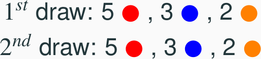
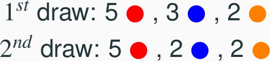
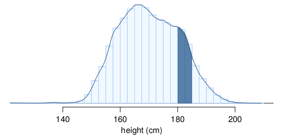

<style>
citation {
  font-size: 4px;
}
</style>

<!--  Version 1.0-0

      This version of the slides is taken directly from Mine Çetinkaya-Rundel's lecture slides
      posted on OpenIntro.org in PDF (LaTeX) format, and moved to Rmd. Topic is Chapter 2-1 and 2-2
      of OpenIntro Statistics, Probability, introduction through Bayes'.
      
      A large part of the HTML/CSS formatting is janky, and could be cleaned up. Feel free to issue a 
      pull request if you love HTML and CSS and want to fix this up.
      
      - wburr, Sept 28, 2018
-->

<!-- this is the knitr block to import a figure with some precision. Could just use HTML ...
<center>
```{r, out.width = "800px", echo = FALSE}
knitr::include_graphics("fig/fig_1_7_boxplots.png")
```
</center>-->

## Note

This set of slides covers Chapters 3.3-3.5 in the 4th edition of our textbook.

<!-- Chapter 2.3 -->
# Sampling from small populations

## Sampling with replacement

When sampling **with replacement**, you put back what you just drew.

* Imagine you have a bag with 5 red, 3 blue and 2 orange chips in it. What is the probability that the first chip you draw is blue?

<center>
```{r, out.width = "300px", echo = FALSE}

```
</center>

## Sampling with replacement

When sampling **with replacement**, you put back what you just drew.

* Imagine you have a bag with 5 red, 3 blue and 2 orange chips in it. What is the probability that the first chip you draw is blue?

<center>
```{r, out.width = "300px", echo = FALSE}

```
</center>

$$
Prob(1^{st} \text{ chip } B) = \frac{3}{5 + 3 + 2} = \frac{3}{10} = 0.3
$$

## Sampling with replacement

When sampling **with replacement**, you put back what you just drew.

* Suppose you did indeed pull a blue chip in the first draw. If drawing with replacement, what is the probability of drawing a blue chip in the second draw?

<center>
```{r, out.width = "300px", echo = FALSE}

```
</center>

## Sampling with replacement

When sampling **with replacement**, you put back what you just drew.

* Suppose you did indeed pull a blue chip in the first draw. If drawing with replacement, what is the probability of drawing a blue chip in the second draw?

<center>
```{r, out.width = "300px", echo = FALSE}

```
</center>

$$
Prob(2^{nd} \text{ chip } B | 1^{st} \text{ chip } B) = \frac{3}{10} = 0.3
$$

## Sampling with replacement (cont.)

* Suppose you actually pulled an orange chip in the first draw. If drawing with replacement, what is the probability of drawing a blue chip in the second draw?

<center>
```{r, out.width = "300px", echo = FALSE}

```
</center>

## Sampling with replacement (cont.)

* Suppose you actually pulled an orange chip in the first draw. If drawing with replacement, what is the probability of drawing a blue chip in the second draw?

<center>
```{r, out.width = "300px", echo = FALSE}

```
</center>

$$
Prob(2^{nd} \text{ chip } B | 1^{st} \text{ chip } O) = \frac{3}{10} = 0.3
$$

## Sampling with replacement (cont.)

* If drawing with replacement, what is the probability of drawing two blue chips in a row?

<center>
```{r, out.width = "300px", echo = FALSE}

```
</center>

## Sampling with replacement (cont.)

* If drawing with replacement, what is the probability of drawing two blue chips in a row?

<center>
```{r, out.width = "300px", echo = FALSE}

```
</center>

$$
Prob(1^{st} \text{ chip } B) \cdot Prob(2^{nd} \text{ chip } B | 1^{st} \text{ chip } B) \\= 0.3 \times 0.3 
 = 0.3^2 = 0.09 
$$

## Sampling with replacement (cont.)

* When drawing with replacement, probability of the second chip being blue does not depend on the color of the first chip since whatever we draw in the first draw gets put back in the bag.
$$
Prob(B | B) = Prob(B | O) 
$$
* In addition, this probability is equal to the probability of drawing a blue chip in the first draw, since the composition of the bag never changes when sampling with replacement.
$$
Prob(B | B) = Prob(B)
$$
* **When drawing with replacement, draws are independent.**

## Sampling without replacement

When drawing *without replacement* you do not put back what you just drew.

* Suppose you pulled a blue chip in the first draw. If drawing without replacement, what is the probability of drawing a blue chip in the second draw?

<center>
```{r, out.width = "300px", echo = FALSE}

```
</center>

## Sampling without replacement

When drawing *without replacement* you do not put back what you just drew.

* Suppose you pulled a blue chip in the first draw. If drawing without replacement, what is the probability of drawing a blue chip in the second draw?

<center>
```{r, out.width = "300px", echo = FALSE}

```
</center>

$$
Prob(2^{nd} \text{ chip } B | 1^{st} \text{ chip } B) = \frac{2}{9} = 0.22 
$$

## Sampling without replacement

When drawing *without replacement* you do not put back what you just drew.

* If drawing without replacement, what is the probability of drawing two blue chips in a row?

<center>
```{r, out.width = "300px", echo = FALSE}

```
</center>

## Sampling without replacement

When drawing *without replacement* you do not put back what you just drew.

* If drawing without replacement, what is the probability of drawing two blue chips in a row?

<center>
```{r, out.width = "300px", echo = FALSE}

```
</center>

$$
Prob(1^{st} \text{ chip } B) \cdot Prob(2^{nd} \text{ chip } B | 1^{st} \text{ chip } B)  \\
= 0.3 \times 0.22 = 0.066 
$$

## Sampling without replacement (cont.)

* When drawing without replacement, the probability of the second chip being blue given the first was blue is not equal to the probability of drawing a blue chip in the first draw since the composition of the bag changes with the outcome of the first draw.
$$
Prob(B | B) \ne Prob(B)
$$

* **When drawing without replacement, draws are not independent.**
* This is especially important to take note of when the sample sizes are small. If we were dealing with, say, 10,000 chips in a (giant) bag, taking out one chip of any color would not have as big an impact on the probabilities in the second draw.

## Practice

**In most card games cards are dealt without replacement. What is the probability of being dealt an ace and then a 3? Choose the closest answer.**

1. 0.0045
2. 0.0059
3. 0.0060
4. 0.1553

## Practice

**In most card games cards are dealt without replacement. What is the probability of being dealt an ace and then a 3? Choose the closest answer.**

1. 0.0045
2. 0.0059
3. <span id="highlight">0.0060</span>
4. 0.1553

$$
P(\text{ace then 3}) = \frac{4}{52} \times \frac{4}{51} \approx 0.0060 
$$

# Random variables

## Random variables

* A **random variable** is a numeric quantity whose value depends on the outcome of a random event
    - We use a capital letter, like $X$, to denote a random variable
    - The values of a random variable are denoted with a lowercase letter, in this case $x$
    - We write this as $P(X = x)$
 
## Random variables

* A **random variable** is a numeric quantity whose value depends on the outcome of a random event
    - We use a capital letter, like $X$, to denote a random variable
    - The values of a random variable are denoted with a lowercase letter, in this case $x$
    - We write this as $P(X = x)$
* There are two types of random variables:
    - **Discrete random variables** often take only integer values
        * **Example**: Number of credit hours, Difference in number of credit hours this term vs last
    - **Continuous random variables** take real (decimal) values
        * **Example**: Cost of books this term, Difference in cost of books this term vs last

## Expectation

* We are often interested in the average outcome of a random variable.
* We call this the **expected value**, or **mean**, and it is a weighted average of the possible outcomes
$$
\mu = E(X) = \sum_{i = 1}^k x_i ~ P(X = x_i)
$$

## Expected value of a discrete random variable

In a game of cards you win \$1 if you draw a heart, \$5 if you draw an ace (including the ace of hearts), \$10 if you draw the king of spades and nothing for any other card you draw. Write the probability model for your winnings, and calculate your expected winning.

Event		          $X$ 		          $P(X)$        	   $X ~ P(X)$ 
------            -----             -----------------  ----------------
Heart (not ace)	  $1$		            12/52              12/52          
Ace			          $5$	          	  4/52               20/52             	
King of spades	  $10$		          1/52               10/52           
All else		      $0$		            35/52              0

## Expected value of a discrete random variable

Event		          $X$ 		          $P(X)$        	   $X ~ P(X)$ 
------            -----             -----------------  ----------------
Heart (not ace)	  $1$		            12/52              12/52          
Ace			          $5$	          	  4/52               20/52             	
King of spades	  $10$		          1/52               10/52           
All else		      $0$		            35/52              0
Total                                                  $E[X] = 42/52 \approx 0.81$

## Expected value of a discrete random variable (cont.)

Below is a visual representation of the probability distribution of winnings from this game:

<center>
```{r, out.width = "700px", echo = FALSE}
knitr::include_graphics("fig/card_game.png")
```
</center>

## Variability in random variables

We are also often interested in the variability in the values of a random variable.

$$
\sigma^2 = Var(X) = \sum_{i = 1}^k \left(x_i - E(X)\right)^2 P(X = x_i)\\
\;\\
\sigma = SD(X) = \sqrt{Var(X)}
$$

## Variability of a discrete random variable

**For the previous card game example, how much would you expect the winnings to vary from game to game?**

$X$       $P(X)$       $X~P(X)$            $(X-E[X])^2$             $P(X)\cdot (X-E[X])^2$
-----     ----------   ------------------  ----------------------   --------------------------
1         12/52        1 x 12/52 = 12/52   $(1-0.81)^2 = 0.0361     12/52 x 0.0361 = 0.0083
5         4/52         5 x 4/52 = 20/52    $(5-0.81)^2 = 17.5561    4/52 x 17.5561 = 1.3505
10        1/52         10 x 1/52 = 10/52   $(10-0.81)^2 = 84.4561   1/52 x 84.0889 = 1.6242
0         35/52        0 x 35/52 = 0       $(0-0.81)^2 = 0.6561     35/52 x 0.6561 = 0.4416
                       $E[X] = 0.81$
                       
## Variability of a discrete random variable

**For the previous card game example, how much would you expect the winnings to vary from game to game?**

$X$       $P(X)$       $X~P(X)$            $(X-E[X])^2$             $P(X)\cdot (X-E[X])^2$
-----     ----------   ------------------  ----------------------   --------------------------
1         12/52        1 x 12/52 = 12/52   $(1-0.81)^2 = 0.0361     12/52 x 0.0361 = 0.0083
5         4/52         5 x 4/52 = 20/52    $(5-0.81)^2 = 17.5561    4/52 x 17.5561 = 1.3505
10        1/52         10 x 1/52 = 10/52   $(10-0.81)^2 = 84.4561   1/52 x 84.0889 = 1.6242
0         35/52        0 x 35/52 = 0       $(0-0.81)^2 = 0.6561     35/52 x 0.6561 = 0.4416
                       $E[X] = 0.81$                                $V[X] = 3.4246$
                                                                    $SD(X) = \sqrt{3.4246} = 1.85$
                                                                    

## Variability: the R way

We could also do all of this in R, and it's easier: no tracking decimals, no computations!
```{r}
x <- c(1, 5, 10, 0)
pX <- c(12/52, 4/52, 1/52, 35/52)
var <- pX * (x - sum(x * pX))^2
var
sum(var)
```

## Linear combinations of random variables

* A **linear combination** of random variables $X$ and $Y$ is given by
$$
aX + bY 
$$
where $a$ and $b$ are some fixed numbers.

## Linear combinations of random variables

* A **linear combination** of random variables $X$ and $Y$ is given by
$$
aX + bY 
$$
where $a$ and $b$ are some fixed numbers.
* The average value of a linear combination of random variables is given by
$$
E(aX + bY) = a \times E(X) + b \times E(Y)
$$

## Calculating the expectation of a linear combination

On average you take 10 minutes for each statistics homework problem and 15 minutes for each chemistry homework problem. This week you have 5 statistics and 4 chemistry homework problems assigned. What is the total time you expect to spend on statistics and physics homework for the week?

## Calculating the expectation of a linear combination

On average you take 10 minutes for each statistics homework problem and 15 minutes for each chemistry homework problem. This week you have 5 statistics and 4 chemistry homework problems assigned. What is the total time you expect to spend on statistics and physics homework for the week?

$$
\begin{split}
E(S + S + S + S + S + C + C + C + C) &= 5 \times E(S) + 4 \times E(C) \\
&= 5 \times 10 + 4 \times 15 \\
&= 50 + 60 \\
&= 110~\text{min }
\end{split}
$$

## Variability in linear combinations of random variables

* The variability of a linear combination of two independent random variables is calculated as
$$
V(aX + bY) = a^2 \times V(X) + b^2 \times V(Y)
$$
* The standard deviation of the linear combination is the square root of the variance.

**If the random variables are not independent, the variance calculation gets a little more complicated and is beyond the scope of this course.**

## Calculating the variance of a linear combination

The standard deviation of the time you take for each statistics homework problem is 1.5 minutes, and it is 2 minutes for each chemistry problem. What is the standard deviation of the time you expect to spend on statistics and physics homework for the week if you have 5 statistics and 4 chemistry homework problems assigned? Suppose that the time it takes to complete each problem is independent of another.

## Calculating the variance of a linear combination

The standard deviation of the time you take for each statistics homework problem is 1.5 minutes, and it is 2 minutes for each chemistry problem. What is the standard deviation of the time you expect to spend on statistics and physics homework for the week if you have 5 statistics and 4 chemistry homework problems assigned? Suppose that the time it takes to complete each problem is independent of another.

$$
\begin{split}
V(S+S+S+S+S+C+C+C) &= V(S) + V(S) + V(S) + V(S) + \\ &\phantom{==}V(S) + V(C) + V(C) + V(C) + V(C) \\
&= 5 \times V(S) + 4 \times V(C) \\
&= 5 \times 1.5^2 + 4 \times 2^2 \\
&= 27.25
\end{split}
$$

## Calculating Variance: the R way

```{r}
5 * 1.5^2 + 4 * 2^2
```

## Practice

A casino game costs \$5 to play. If the first card you draw is red, then you get to draw a second card (without replacement). If the second card is the ace of clubs, you win \$500. If not, you don't win anything, i.e. lose your \$5. What is your expected profits/losses from playing this game? **<span style="font-size:16px;">Remember: profit/loss = winnings - cost.</span>**

* A profit of 5 cents
* A loss of 10 cents
* A loss of 25 cents
* A loss of 30 cents

## Practice

A casino game costs \$5 to play. If the first card you draw is red, then you get to draw a second card (without replacement). If the second card is the ace of clubs, you win \$500. If not, you don't win anything, i.e. lose your \$5. What is your expected profits/losses from playing this game? **<span style="font-size:16px;">Remember: profit/loss = winnings - cost.</span>**

$$
\text{A profit of 5 cents}\qquad \text{A loss of 25 cents}\\
\text{A loss of 10 cents} \qquad \text{A loss of 30 cents}
$$

Event                     Win             Profit:$~X$              $P(X)$                                        $X\cdot P(X)$
--------                  -----------     --------------------     ------------------------------------------    -------------------
**Red**, A{$\clubsuit$}   500             $500 - 5 = 495$          $\frac{26}{52} \cdot\frac{1}{51} = 0.0098$    $495 \times 0.0098 = 4.851$ 
Other                     0               $0 - 5 = -5$             $1 - 0.0098 = 0.9902$                         $-5 \times 0.9902 = -4.951$ 
                                                                                                                 $E(X) = -0.1$

## Fair game

A **fair** game is defined as a game that costs as much as its expected payout, i.e. expected profit is 0.

## Fair game

A **fair** game is defined as a game that costs as much as its expected payout, i.e. expected profit is 0.

**Do you think casino games in Vegas cost more or less than their expected payouts?**

<div style= "float:right;position: relative; left: 10px; top: -20px;">
<center>
```{r, out.width = "400px", echo = FALSE}

```
</center>
</div>
If those games cost less than their expected payouts, it would mean that the casinos would be losing money on average, and hence they wouldn't be able to pay for all this:

<!--<span id="footnote">Image by Moyan_Brenn on Flickr http://www.flickr.com/photos/aigle_dore/5951714693</span>-->

## Simplifying random variables

Random variables do not work like normal algebraic variables:
$$
X + X \ne 2X
$$

## Simplifying random variables

Random variables do not work like normal algebraic variables:
$$
X + X \ne 2X
$$

$$
\begin{align*}
E(X + X) &= E(X) + E(X) \\
&= 2 E(X) \\
&~  \\
E(2X) &= 2 E(X) \\
&~ 
\end{align*}
$$

## Simplifying random variables (cont.)
$$
\begin{align*}
Var(X + X) &= Var(X) + Var(X)~{\scriptsize \text{(assuming independence)}} \\
&= 2~Var(X) \\
&~  \\
Var(2X) &= 2^2~Var(X) \\
&= 4~Var(X)
\end{align*}
$$

**So**:
$$
E(X + X)  = E(2X), \text{ but }  Var(X + X) \ne Var(2X)
$$

## Adding or multiplying?

A company has 5 Lincoln Town Cars in its fleet. Historical data show that annual maintenance cost for each car is on average \$2,154 with a standard deviation of \$132. What is the mean and the standard deviation of the total annual maintenance cost for this fleet?

Note that we have 5 cars each with the given annual maintenance cost $(X_1 + X_2 + X_3 + X_4 + X_5)$, not one car that had 5 times the given annual maintenance cost $(5X)$.

## Adding or multiplying?

$$
\begin{split}
E(X_1 + X_2 + X_3 + X_4 + X_5) &=& E(X_1) + E(X_2) + \cdots + E(X_5) \\
&=& 5 \times E(X) = 5 \times 2,154 = \$ 10,770 \\
Var(X_1 + X_2 + X_3 + X_4 + X_5) &=& Var(X_1) + Var(X_2) + \cdots + Var(X_5) \\
&=& 5 \times V(X) = 5 \times 132^2 = \$ 87,120 \\
SD(X_1 + X_2 + X_3 + X_4 + X_5) &=& \sqrt{87,120} =  295.16
\end{split}
$$

# The Binomial Distribution

## Binomial Distribution

A **very** important discrete distribution is the **binomial distribution**, which results when we have:

* a **fixed** number of trials $n$
* only **two** outcomes possible in each trial
* each trial is **independent**
* the probability of a **success** is the same

**Definition**: the binomial distribution counts the number of successes in $n$ independent trials
of an experiment with fixed probability of success $p$

## Binomial Notation

* $n$ - the fixed number of trials/experiments
* $x$ - a specific number of successes we are interested in (must be between $0$ and $n$, obviously)
* $p$ - probability of success in any one trial/experiment
* $P(X)$ - the probability of getting exactly $x$ successes in $n$ trials

## Things To Be Cautious Of

* make sure that $x$ and $p$ are referring to the same event
as success
* make sure that all trials/experiments are independent
* when sampling **without** replacement, make sure your total
number of trials/experiments is small when compraed to population

## Example 1

Suppose you have no idea how to answer the questions on a True/False
test with 10 questions, and you decide to just flip a coin for each one. You then count how many questions you actually got correct. 

* $x =$ number of questions correct
* $n = 10$
* $p = 0.5$ (fair coin?)
* trials are independent, since the coin flips have nothing to do with one another

In this situation, what is the probability of getting at least 6/10?

## Example 2

According to Statistics Canada, as of the last census in 2016,
86.3% of Canadians between the ages of 25 and 64 have a completed
high school diploma, or equivalent. If we randomly select 15
Canadians aged 25-64, what is the probability distribution
of the number of sampled people who have completed a high school
diploma? 

Find the probability that **at least 8 out of 15** randomly
selected Canadians aged 25-64 will have such a diploma.

## The Binomial Probability Formula

$$
P(x) = \frac{n!}{(n-x)!x!} \cdot p^x \cdot (1-p)^{n-x}
$$

Note that this probability formula is for **one specific value of $x$**. So if you are asked something involving multiple cases of
$x$, you have to do multiple computations!

**We will use R to compute these, as they are very, very tedious by hand.**

## Example 2

* $n = 15$
* $p = 0.863$
* $x \geq 8$

Then:
```{r}
sum( dbinom(8:15, 15, 0.863) )
pbinom(q = 7, size = 15, prob = 0.863, lower.tail = FALSE)
```
(Note: we'll talk more about the $q=7$ in a couple of slides)

## R Syntax for Computing Things with Binomials

There are two functions we will use: **dbinom()** and 
**pbinom()**. The **d** stands for **distribution**, and 
corresponds to the formula back two slides.

**Example:**
```{r}
dbinom(x = 6, size = 10, prob = 0.5)
```
This gives the probability of **exactly six correct** answers in ten
trials with a 50/50 probability (Example 1).

## R Syntax for Computing Things with Binomials

**Example:**
```{r}
pbinom(q = 6, size = 10, prob = 0.5, lower.tail = TRUE)
```
This gives the probability of getting **six or less correct**
answers in ten trials, again with a 50/50 probability (like Example 1).

## R Syntax for Computing Things with Binomials

**Example:**
```{r}
pbinom(q = 6, size = 10, prob = 0.5, lower.tail = FALSE)
```
This gives the probability of getting **MORE THAN SIX correct**
answers in ten trials, again with a 50/50 probability (like Example 1).

**Note**: this is **not** "greater than or equal to", it is strictly
**greater than**. That is, if **q = 6**, this means {7, 8, 9, 10},
**not** {6, 7, 8, 9, 10}.

## General R Syntax

```{r, eval = FALSE}
pbinom(q = max or min number of successes,
       size = total number of trials,
       prob = probability of success,
       lower.tail = TRUE for q being max, FALSE for q being min)

dbinom(x = number of successes interested in,
       size = total number of trials,
       prob = probability of success)
```

# Continuous Distributions

## Continuous distributions

* Below is a histogram of the distribution of heights of US adults. 
* The proportion of data that falls in the shaded bins gives the probability that a randomly sampled US adult is between 180 cm and 185 cm (about 5'11" to 6'1").

<center>
```{r, out.width = "600px", echo = FALSE}
knitr::include_graphics("fig/usHeightsHist180185.png")
```
</center>

## From histograms to continuous distributions

Since height is a continuous numerical variable, its **probability density function** is a smooth curve.

<center>
```{r, out.width = "600px", echo = FALSE}
knitr::include_graphics("fig/fdicHeightContDist.png")
```
</center>


## Probabilities from continuous distributions

Therefore, the probability that a randomly sampled US adult is between 180 cm and 185 cm can also be estimated as the shaded area under the curve.

<center>
```{r, out.width = "600px", echo = FALSE}

```
</center>

## By definition...

Since continuous probabilities are estimated as "the area under the curve", the probability of a person being exactly 180 cm (or any exact value) is defined as 0.

<center>
```{r, out.width = "600px", echo = FALSE}
knitr::include_graphics("fig/fdicHeightContDist180.png")
```
</center>
