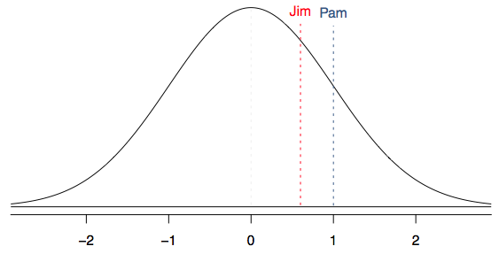
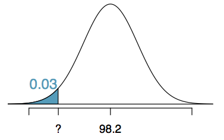
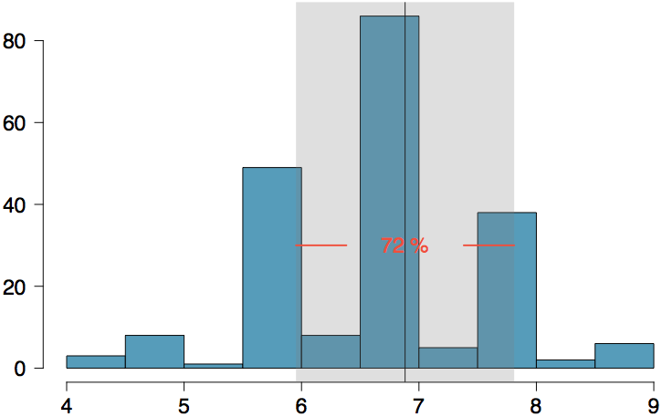

<style>
citation {
  <!-- font-size: 4px; -->
}
</style>

<!--  Version 1.0-0

      This version of the slides is adapted from Mine Çetinkaya-Rundel's lecture slides
      posted on OpenIntro.org in PDF (LaTeX) format, and moved to Rmd. Topic of Chapter 2
      of OpenIntro Statistics & Randomization, Probability. Moved into the OpenIntro Statistics
      coverage 2018.

      A large part of the HTML/CSS formatting is janky, and could be cleaned up. Feel free to issue a
      pull request if you love HTML and CSS and want to fix this up.

      - wburr, Sept 21, 2018
-->

<!--
<center>
```{r, out.width = "800px", echo = FALSE}
knitr::include_graphics("fig/fig_1_7_boxplots.png")
```
</center>-->

# Normal Distribution

## The Normal Distribution
* Unimodal and symmetric, bell shaped curve
* Many variables are nearly normal, but none are exactly normal
* Denoted as $\mathcal{N}(\mu, \sigma) \rightarrow$ Normal with mean $\mu$ and standard deviation $\sigma$

<div style= "float:center; position: relative; top: -25px; left:150px;">
```{r, echo=FALSE, out.width = "550px"}
plot(x = seq(-4, 4, 0.01), y = dnorm(seq(-4, 4, 0.01)), xlab = "", ylab = "", type = "l", yaxt = 'n', xaxt = 'n')
```
</div>

## Heights of Males
<div style= "float:left; position: relative; top:-20px; right:10px;">
```{r, echo=FALSE, out.width = "400px"}

```
</div>

“The male heights on OkCupid very nearly follow the expected normal distribution -- except the whole thing is shifted to the right of where it should be. Almost universally guys like to add a couple inches.”

“You can also see a more subtle vanity at work: starting at roughly 5'8", the top of the dotted curve tilts even further rightward. This means that guys as they get closer to six feet round up a bit more than usual, stretching for that coveted psychological benchmark.”

<div id="footnote">http://blog.okcupid.com/index.php/the-biggest-lies-in-online-dating</div>

## Heights of Females
<div style= "float:left; position: relative; top:-20px; right:10px;">
```{r, echo=FALSE, out.width = "400px"}
knitr::include_graphics("fig/fig_2_6_okcupid2.png")
```
</div>
“When we looked into the data for women, we were surprised to see height exaggeration was just as widespread, though without the lurch towards a benchmark height.”

<div id="footnote">http://blog.okcupid.com/index.php/the-biggest-lies-in-online-dating</div>

## Normal distributions with different parameters

<div style= "float:center; position: relative; top:-20px; left:200px;">
```{r, echo=FALSE, out.width = "500px"}
knitr::include_graphics("fig/fig_2_6_mu_sd.png")
```
</div>

***
SAT scores are distributed nearly normally with mean 1500 and standard deviation 300. ACT scores are distributed nearly normally with mean 21 and standard deviation 5. A college admissions officer wants to determine which of the two applicants scored better on their standardized test with respect to the other test takers: Pam, who earned an 1800 on her SAT, or Jim, who scored a 24 on his ACT?

<div style= "float:center; position: relative; top:20px; left:200px;">
```{r, echo=FALSE, out.width = "600px"}
knitr::include_graphics("fig/fig_2_6_pam_jim.png")
```
</div>

## Standardizing with Z-scores

Since we cannot just compare these two raw scores, we instead compare how many standard deviations beyond the mean each observation is.

* Pam's score is $(1800 - 1500) / 300 = 1$ standard deviation above the mean.
* Jim's score is $(24 - 21) / 5 = 0.6$ standard deviations above the mean.

<div style= "float:center; position: relative; top:20px; left:200px;">
```{r, echo=FALSE, out.width = "550px"}

```
</div>

## Standardizing with Z-scores (continued)

These are called **standardized scores**, or **Z-scores** (or **Z scores**).

* Z score of an observation is the number of standard deviations it falls above or below the mean.
$$
Z = (\text{observation} - \text{mean}) / \text{SD}
$$
* Z scores are defined for distributions of any shape, but only when the distribution is normal can we use Z scores to calculate percentiles.
* Observations that are more than 2 SD away from the mean ($|Z| > 2$) are usually considered unusual.

## Percentiles

* **Percentile** is the percentage of observations that fall below a given data point
* Graphically, percentile is the area below the probability distribution curve to the left of that observation

<div style= "float:center; position: relative; top:20px; left:200px;">
```{r, echo=FALSE, out.width = "550px"}

```
</div>

## Calculating Percentiles using Computation
There are many ways to compute percentiles/areas under the curve.

**R**:
```{r}
pnorm(1800, mean = 1500, sd = 300)
```

**Applets**:
<div style= "float:center; position: relative; top:-20px; left:200px;">
```{r, echo=FALSE, out.width = "500px"}
knitr::include_graphics("fig/fig_2_6_applet.png")
```
</div>


## Six Sigma
The term six sigma process comes from the notion that if one has six standard deviations between the process mean and the nearest specification limit, as shown in the graph, practically no items will fail to meet specifications.

<div style= "float:center; position: relative; top:10px; left:175px;">
```{r, echo=FALSE, out.width = "350px"}
knitr::include_graphics("fig/fig_2_6_sixsigma.png")
```
</div>

<div id="footnote">http://en.wikipedia.org/wiki/Six_Sigma</div>

## Example: Quality Control

At the Heinz ketchup factory, the amounts which go into bottles of ketchup are supposed to be normally distributed with mean 36 oz. and standard deviation 0.11 oz. Once every 30 minutes a bottle is selected from the production line, and its contents are noted precisely. If the amount of ketchup in the bottle is below 35.8 oz. or above 36.2 oz., then the bottle fails the quality control inspection. What percent of bottles have less than 35.8 ounces of ketchup?

* Let $X$ = amount of ketchup in a bottle: $X \sim \mathcal{N}(\mu = 36, \sigma = 0.11)$

<div style= "float:left; position: relative; top:-10px; right:25px;">
```{r, echo=FALSE, out.width = "350px"}
knitr::include_graphics("fig/fig_2_6_qc.png")
```
</div>
$$
Z = \frac{35.8 - 36}{0.11} = -1.82
$$

## Finding the exact probability - using R

```{r}
pnorm(q = -1.82, lower.tail = TRUE)
```

Simple!

## Practice

What percentage of bottles **pass** the quality control inspection?

1. 1.82%   &nbsp; &nbsp; &nbsp; 4. 93.12%
2. 3.44%   &nbsp; &nbsp; &nbsp; 5. 95.56%
3. 6.88%

## Practice

What percentage of bottles **pass** the quality control inspection?

1. 1.82%   &nbsp; &nbsp; &nbsp; 4.<div id="highlight"> 93.12%</div>
2. 3.44%   &nbsp; &nbsp; &nbsp; 5. 95.56%
3. 6.88%

<div style="float:left; position:relative; left:100px;">
```{r, echo=FALSE, out.width = "200px"}
knitr::include_graphics("fig/fig_2_6_normal1.png")
```
</div>
<div style="float:left; position:relative; top:-10px; left:100px;">
```{r, echo=FALSE, out.width = "200px"}
knitr::include_graphics("fig/fig_2_6_normal2.png")
```
</div>
<div style="float:left; position:relative; top:-20px; left:120px;">
```{r, echo=FALSE, out.width = "200px"}
knitr::include_graphics("fig/fig_2_6_normal3.png")
```
</div>

<br />

<div style="font-size:18px; top:-50px;">
$$
\begin{split}
Z_{35.8} &= \frac{35.8 - 36}{0.11} = -1.82 \\
Z_{36.2} &= \frac{36.2 - 36}{0.11} = 1.82 \\
P(35.8 < X < 36.2) &= P(-1.82 < Z < 1.82) = 0.9656 - 0.0344 = 0.9312 = 93.12\%
\end{split}
$$
</div>

## Example: Finding Cutoff Points
Body temperatures of healthy humans are distributed nearly normally with mean 98.2$^\circ$F and standard deviation 0.73$^\circ$F. What is the cutoff for the lowest 3% of human body temperatures?

<div style="float:left; position:relative; top:-20px; left:50px;">
```{r, echo=FALSE, out.width = "250px"}

```
</div>
<div style="float:left; position:relative; top:-20px; left:100px;">
```{r, echo=FALSE, out.width = "400px"}
knitr::include_graphics("fig/fig_2_6_zoom_table.png")
```
</div>

<br />

<div style="font-size:18px; top:-50px;">
$$
\begin{split}
P(X < x) &= 0.03 \longrightarrow P(Z < -1.88) = 0.03 \\
Z &= \frac{\text{obs} - \text{mean}}{\text{SD}} \longrightarrow \frac{x - 98.2}{0.73} = -1.88 \\
x &= (-1.88 \times 0.73) + 98.2 = 96.8^\circ\text{F}
\end{split}
$$
</div>

<div id="footnote">Mackowiak, Wasserman, and Levine (1992), A Critical Appraisal of 98.6 Degrees F, the Upper Limit of the Normal Body Temperature, and Other Legacies of Carl Reinhold August Wunderlick.</div>

## Practice

Body temperatures of healthy humans are distributed nearly normally with mean 98.2$^\circ$F and standard deviation 0.73$^\circ$F. What is the cutoff for the highest 10% of human body temperatures?

1. 97.3$^\circ$F &nbsp; &nbsp; &nbsp; 3. 99.4$^\circ$F
2. 99.1$^\circ$F &nbsp; &nbsp; &nbsp; 4. 99.6$^\circ$F

## Practice
Body temperatures of healthy humans are distributed nearly normally with mean 98.2$^\circ$F and standard deviation 0.73$^\circ$F. What is the cutoff for the highest 10% of human body temperatures?

1. 97.3$^\circ$F &nbsp; &nbsp; &nbsp; 3. 99.4$^\circ$F
2. <span id="highlight">99.1$^\circ$F</span> &nbsp; &nbsp; &nbsp; 4. 99.6$^\circ$F

<div style="float:left; position:relative; top:-20px; left:50px;">
```{r, echo=FALSE, out.width = "250px"}
knitr::include_graphics("fig/fig_2_6_normal_practice.png")
```
</div>
<div style="float:left; position:relative; top:-20px; left:100px; ">
```{r, echo=FALSE, out.width = "400px"}
knitr::include_graphics("fig/fig_2_6_table_practice.png")
```
</div>

<div style="font-size:18px; ">
$$
\begin{split}
P(X > x) &= 0.10 \longrightarrow P(Z > 1.28) = 0.10 \\
Z &= \frac{\text{obs} - \text{mean}}{\text{SD}} \longrightarrow \frac{x - 98.2}{0.73} = 1.28 \\
x &= (1.28 \times 0.73) + 98.2 = 99.1^\circ\text{F}
\end{split}
$$
</div>

## 68-95-99.7 Rule

For normally distributed data,

* about 68% falls within 1 SD of the mean
* about 95% falls within 2 SD of the mean
* about 99.7% falls within 3 SD of the mean

It is possible for observations to fall 4, 5 or even more standard deviations away from the mean, but these occurrences are very rare if the data are nearly normal.

<div style="float:left; position:relative; top:-20px; left:250px;">
```{r, echo=FALSE, out.width = "400px"}
knitr::include_graphics("fig/fig_2_6_sd_rule.png")
```
</div>

## Describing variability using the 68-95-99.7 Rule

<div style="font-size:22px;">
SAT scores are distributed nearly normally, with mean 1500 and standard deviation 300. 

* $\approx$ 68% of students score between 1200 and 1800 on the SAT
* $\approx$ 95% of students score between 900 and 2100 on the SAT
* $\approx$ 99.7% of students score between 600 and 2400 on the SAT
</div>

<div style="float:left; position:relative; top:-10px; left:250px;">
```{r, echo=FALSE, out.width = "375px"}
knitr::include_graphics("fig/fig_2_6_sd_rule_specific.png")
```
</div>

<div id="footnote">Note that it is not possible to achieve more than 2400 points on the SAT. In 2015, 1.7 million students took the SAT, with an average score of 1490 and less than 8500 students scoring higher than 2280.</div>

## Example: Number of nights of sleep on school nights

<div style="float:left; position:relative; top:-10px; left:200px;">
```{r, echo=FALSE, out.width = "500px"}
knitr::include_graphics("fig/fig_2_6_hist.png")
```
</div>

## Example: Number of nights of sleep on school nights

<div style="width:100%; float:left; position:relative; top:-10px; left:200px;">
```{r, echo=FALSE, out.width = "500px"}

```
</div>

<div style="font-size:22px;">
Mean = 6.88 hours, SD = 0.92 hours.  <br />
72% of the data are within 1 SD of the mean: 6.88 $\pm$ 0.93.
</div>

## Example: Number of nights of sleep on school nights

<div style="width:100%; float:left; position:relative; top:-10px; left:200px;">
```{r, echo=FALSE, out.width = "500px"}
knitr::include_graphics("fig/fig_2_6_hist3.png")
```
</div>

<div style="font-size:22px;">
Mean = 6.88 hours, SD = 0.92 hours. <br />
72% of the data are within 1 SD of the mean: 6.88 $\pm$ 0.93.<br />
92% of the data are within 2 SD of the mean: 6.88 $\pm$ 2 $\times$ 0.93.
</div>

## Example: Number of nights of sleep on school nights

<div style="width:100%; float:left; position:relative; top:-10px; left:200px;">
```{r, echo=FALSE, out.width = "500px"}
knitr::include_graphics("fig/fig_2_6_hist4.png")
```
</div>

<div style="font-size:22px;">
Mean = 6.88 hours, SD = 0.92 hours. <br />
72% of the data are within 1 SD of the mean: 6.88 $\pm$ 0.93.<br />
92% of the data are within 2 SD of the mean: 6.88 $\pm$ 2 $\times$ 0.93. <br />
99% of the data are within 3 SD of the mean: 6.88 $\pm$ 3 $\times$ 0.93. 
</div>

## Practice

Which of the following is **false**?

1. Majority of Z scores in a right skewed distribution are negative.
2. In a skewed distributions the Z score of the mean might be different than 0.
3. For a normal distribution, IQR is less than 2 x SD.
4. Z scores are helpful for determining how unusual a data point is compared to the rest of the data in the distribution.

## Practice

Which of the following is **false**?

1. Majority of Z scores in a right skewed distribution are negative.
2. In a skewed distributions the Z score of the mean might be different than 0.
3. <span id="highlight">For a normal distribution, the IQR is less than 2 x SD.</span>
4. Z scores are helpful for determining how unusual a data point is compared to the rest of the data in the distribution.

# The Normal Approximation

## Evaluating The Normal Approximation

We often use the normal distribution as an **approximation**, 
taking real data and assuming it follows the normal.

<br>
How do we tell whether this is a good assumption?

## Normal probability plot (QQ)

A histogram and **normal probability plot** of a sample of 100 male heights.

<center>
```{r, out.width = "700px", echo = FALSE}

```
</center>

<br>
The right hand plot is also called a **quantile-quantile plot**, or **QQ plot** for short.

## Anatomy of a normal probability plot

* Data are plotted on the y-axis of a normal probability plot, and theoretical quantiles (following a normal distribution) on the x-axis.
* If there is a linear relationship in the plot, then the data follow a nearly normal distribution.
*  Constructing a normal probability plot requires calculating percentiles and corresponding z-scores for each observation, which is tedious. Therefore we generally rely on R when making these plots.

## NBA Heights, 2008-09

Below is a histogram and normal probability plot for the NBA heights from the 2008-2009 season. Do these data appear to follow a normal distribution?

<center>
```{r, out.width = "700px", echo = FALSE}

```
</center>

## NBA Heights, 2008-09

Below is a histogram and normal probability plot for the NBA heights from the 2008-2009 season. Do these data appear to follow a normal distribution?

<center>
```{r, out.width = "700px", echo = FALSE}

```
</center>

<br>
**Why do the points on the normal probability have jumps?**

## Normal probability plot and skewness

<center>
**Left Skew** <br/>
```{r, out.width = "400px", echo = FALSE}
knitr::include_graphics("fig/qq_ls.png")
```
</center>

## Normal probability plot and skewness

<center>
**Right Skew** <br/>
```{r, out.width = "400px", echo = FALSE}

```
</center>

## Normal probability plot and skewness

<center>
**Long Tails** <br/>
```{r, out.width = "400px", echo = FALSE}
knitr::include_graphics("fig/qq_lt.png")
```
</center>

## Normal probability plot and skewness

<center>
**Short Tails** <br/>
```{r, out.width = "400px", echo = FALSE}

```
</center>

# Binomial Distribution (again)

## The Binomial Distribution


## Gallup Poll: Obesity in America

A 2012 Gallup survey suggests that 26.2% of Americans are obese. Among a random sample of 10 Americans, what is the probability that exactly 8 are obese?

* pretty high?
* pretty low?

<div id="footnote">Gallup: http://www.gallup.com/poll/160061/obesity-rate-stable-2012.aspx , January 23, 2013.</div>

## Gallup Poll: Obesity in America

A 2012 Gallup survey suggests that 26.2% of Americans are obese. Among a random sample of 10 Americans, what is the probability that exactly 8 are obese?

* $0.262^8 \times 0.738^2$
* ${8 \choose 10} \times 0.262^8 \times 0.738^2$
* ${10 \choose 8} \times 0.262^8 \times 0.738^2$
* ${10 \choose 8} \times 0.262^2 \times 0.738^8$

## Gallup Poll: Obesity in America

A 2012 Gallup survey suggests that 26.2% of Americans are obese. Among a random sample of 10 Americans, what is the probability that exactly 8 are obese?

* $0.262^8 \times 0.738^2$
* ${8 \choose 10} \times 0.262^8 \times 0.738^2$
* **${10 \choose 8} \times 0.262^8 \times 0.738^2 = 45 \times  0.262^8 \times 0.738^2 = 0.0005$**
* ${10 \choose 8} \times 0.262^2 \times 0.738^8$

## The birthday problem

What is the probability that 2 randomly chosen people share a birthday?

**Pretty low**, $\frac{1}{365} \approx 0.0027$.

## The birthday problem

What is the probability that 2 randomly chosen people share a birthday?

**Pretty low**, $\frac{1}{365} \approx 0.0027$.

What is the probability that at least 2 people out of 366 people share a birthday?

**Exactly 1!** (Excluding the possibility of a leap year birthday.)

## The birthday problem (cont.)

What is the probability that at least 2 people (1 match) out of 121 people share a birthday?

Somewhat complicated to calculate, but we can think of it as the **complement** of the probability that there are no matches in 121 people.

$$
\begin{eqnarray*}
P(\text{no matches}) &=& 1 \times \left(1 - \frac{1}{365}\right) \times \left(1 - \frac{2}{365}\right) \times \cdots \times \left(1 - \frac{120}{365}\right) \\
\end{eqnarray*}
$$

## The birthday problem (cont.)

What is the probability that at least 2 people (1 match) out of 121 people share a birthday?

$$
\begin{eqnarray*}
P(\text{no matches}) &=& \frac{365 \times 364 \times \cdots \times 245}{365^{121}} \\
&=& \frac{365!}{365^{121} \times (365-121)!} \\
&=& \frac{121! \times {365 \choose 121}}{365^{121}} 
\approx 0 \\
P(\text{at least 1 match}) &\approx& 1
\end{eqnarray*}
$$


## Expected value

A 2012 Gallup survey suggests that 26.2% of Americans are obese.

Among a random sample of 100 Americans, how many would you expect to be obese?

## Expected value

A 2012 Gallup survey suggests that 26.2% of Americans are obese.

Among a random sample of 100 Americans, how many would you expect to be obese?

* Easy enough, $100 \times 0.262 = 26.2$.
* Or more formally, $\mu = np = 100 \times 0.262 = 26.2$.
* But this doesn't mean in every random sample of 100 people exactly 26.2 will be obese. In fact, that's not even possible. In some samples this value will be less, and in others more. How much would we expect this value to vary?

## Expected value and its variability

Mean and standard deviation of binomial distribution
$$
\mu = np \qquad \qquad \sigma = \sqrt{np(1-p)}
$$

* Going back to the obesity rate:
$$
\sigma = \sqrt{np(1-p)} = \sqrt{100 \times 0.262 \times 0.738} \approx  4.4
$$
* We would expect 26.2 out of 100 randomly sampled Americans to be obese, with a standard deviation of 4.4.


**Note:** Mean and standard deviation of a binomial might not always be whole numbers, and that is alright, these values represent what we would expect to see on average.

## Unusual observations

Using the notion that **observations that are more than 2 standard deviations away from the mean are considered unusual** and the mean and the standard deviation we just computed, we can calculate a range for the plausible number of obese Americans in random samples of 100.

$$
26.2 \pm (2 \times 4.4) = (17.4, 35)
$$

## Gallup Poll: Home Schooling

An August 2012 Gallup poll suggests that 13% of Americans think home schooling provides an excellent education for children.  Would a random sample of 1,000 Americans where only 100 share this opinion be considered unusual?

<div style= "float:left; position: relative; top:0px; right:10px;">
* Yes
* No
</div>
<div style="float:right; position: relative;">
```{r, out.width = "700px", echo = FALSE}
knitr::include_graphics("fig/homeschool.png")
```
</div>

## Gallup Poll: Home Schooling

$$
\begin{align*}
\mu &= np = 1,000 \times 0.13 = 130 \\
\sigma &= \sqrt{np(1-p)} = \sqrt{1,000 \times 0.13 \times 0.87} \approx 10.6
\end{align*}
$$

* Method 1: Range of usual observations: $130 \pm 2 \times 10.6 = (108.8, 151.2)$ <br>
(100 is outside this range, so would be considered unusual)
* Method 2: Z-score of observation: $Z = \frac{x - mean}{SD} = \frac{100 - 130}{10.6} = -2.83$<br>
(100 is more than 2 SD below the mean, so would be considered unusual)

<div id="footnote">http://www.gallup.com/poll/156974/private-schools-top-marks-educating-children.aspx</div>

## Normal approximation to the binomial (Practice)

Go to https://gallery.shinyapps.io/dist_calc/ and choose Binomial coin experiment in the drop down menu on the left.

* Set the number of trials to 20 and the probability of success to 0.15. Describe the shape of the distribution of number of successes. 
* Keeping $p$ constant at 0.15, determine the minimum sample size required to obtain a unimodal and symmetric distribution of number of successes. Please submit only one response per team.
* Further considerations:
    - What happens to the shape of the distribution as $n$ stays constant and $p$ changes?
    - What happens to the shape of the distribution as $p$ stays constant and $n$ changes?

## Distributions of number of successes

Hollow histograms of samples from the binomial model where $p = 0.10$ and $n = 10$, $30$, $100$, and $300$. What happens as $n$ increases?

<center>
```{r, out.width = "400px", echo = FALSE}

```
</center>


## Low large is large enough?

The sample size is considered large enough if the expected number of successes and failures are both at least 10.
$$
np \ge 10 \qquad \text{ and } \qquad n(1-p) \ge 10
$$

## Practice

Below are four pairs of Binomial distribution parameters. Which distribution can be approximated by the normal distribution?

* $n = 100, p = 0.95$
* $n = 25, p = 0.45$ 
* $n = 150, p = 0.05$
* $n = 500, p = 0.015$

## Practice

Below are four pairs of Binomial distribution parameters. Which distribution can be approximated by the normal distribution?

* $n = 100, p = 0.95$
* **$n = 25, p = 0.45 \rightarrow 25 \times 0.45 = 11.25; 25 \times 0.55 = 13.75$**
* $n = 150, p = 0.05$
* $n = 500, p = 0.015$

## An analysis of Facebook users

A recent study found that "Facebook users get more than they give". For example:

* 40% of Facebook users in our sample made a friend request, but 63% received at least one request
* Users in our sample pressed the like button next to friends' content an average of 14 times, but had their content "liked" an average of 20 times
* Users sent 9 personal messages, but received 12
* 12% of users tagged a friend in a photo, but 35% were themselves tagged in a photo

Any guesses for how this pattern can be explained?

## An analysis of Facebook users

A recent study found that ``Facebook users get more than they give". For example:

* 40% of Facebook users in our sample made a friend request, but 63% received at least one request
* Users in our sample pressed the like button next to friends' content an average of 14 times, but had their content "liked" an average of 20 times
* Users sent 9 personal messages, but received 12
* 12% of users tagged a friend in a photo, but 35% were themselves tagged in a photo

Any guesses for how this pattern can be explained?

**Power users contribute much more content than the typical user.**

<div id="footnote">http://www.pewinternet.org/Reports/2012/Facebook-users/Summary.aspx</div>

## $\;$

This study also found that approximately 25% of Facebook users are considered power users. The same study found that the average Facebook user has 245 friends. What is the probability that the average Facebook user with 245 friends has 70 or more friends who would be considered power users? Note any assumptions you must make.

We are given that $n = 245, p = 0.25$, and we are asked for the probability $P(K \ge 70)$. To proceed, we need independence, which we'll assume but could check if we had access to more Facebook data.

## $\;$

We are given that $n = 245, p = 0.25$, and we are asked for the probability $P(K \ge 70)$. To proceed, we need independence, which we'll assume but could check if we had access to more Facebook data.

$$
\begin{align*}
P(X \ge 70) &= P(K = 70\text{ or }K = 71\text{ or }K = 72\text{ or }\cdots\text{ or } K = 245) \\
&= P(K = 70) + P(K = 71) + P(K = 72) + \cdots + P(K = 245)
\end{align*}
$$

This seems like an awful lot of work...

## Could Use R ...

```{r}
sum(dbinom(x = 70:245, size = 245, prob = 0.25))
pbinom(q = 69, size = 245, prob = 0.25, lower.tail = FALSE)
```

## Normal approximation to the binomial

When the sample size is large enough, the binomial distribution with parameters $n$ and $p$ can be approximated by the normal model with parameters $\mu = np$ and $\sigma = \sqrt{np(1-p)}$.

* In the case of the Facebook power users, $n = 245$ and $p = 0.25$.
$$
\mu = 245 \times 0.25 = 61.25 \qquad \sigma = \sqrt{245 \times 0.25 \times 0.75} = 6.778
$$
* $Bin(n = 245, p = 0.25) \approx N(\mu = 61.25, \sigma = 6.778)$.

## Normal approximation to the binomial

* In the case of the Facebook power users, $n = 245$ and $p = 0.25$.
$$
\mu = 245 \times 0.25 = 61.25 \qquad \sigma = \sqrt{245 \times 0.25 \times 0.75} = 6.778
$$
* $Bin(n = 245, p = 0.25) \approx N(\mu = 61.25, \sigma = 6.778)$.

<center>
```{r, out.width = "350px", echo = FALSE}

```
</center>

## Computing the Approximation

What is the probability that the average Facebook user with 245 friends has 70 or more friends who would be considered power users?

<div style = "float: left; position: relative; right = 20px;">
<center>
```{r, out.width = "300px", echo = FALSE}
knitr::include_graphics("fig/fb_power_user_norm.png")
```
</center>
</div>
<div style = "float: right; position: relative;">
$$
\begin{split}
Z &= \frac{obs - mean}{SD} = \frac{70 - 61.25}{6.778} \\
  &= 1.29094\\
P(Z > 1.29094) &= 1 - 0.90164 \\
&= 0.09836\\
\end{split}
$$
</div>

## Computing the Approximation

What is the probability that the average Facebook user with 245 friends has 70 or more friends who would be considered power users?

<div style = "display: block; width: 100%;">
<div style = "float:left; position: relative; right = 20px; width:50%;">
**But where did this $P(Z > 1.29)$ answer come from? R again!**
</div>
<div style = "float: right; position: relative;">
$$
\begin{split}
Z &= \frac{obs - mean}{SD} = \frac{70 - 61.25}{6.778} \\
  &= 1.29094\\
P(Z > 1.29094) &= 1 - 0.90164 \\
&= 0.09836\\
\end{split}
$$
<br>
</div>
</div>

## Computing Normal Probabilities

Just like we did for **pbinom()** and **dbinom()**, we can do for
**pnorm()** and **dnorm()**. You saw this in workshop last week.

```{r}
pnorm(1.290964, lower.tail = FALSE)
```

## This seems ... bad

We know the exact probability, done using **pbinom()**, is 0.1128. So
why is this "approximation" giving an answer of 0.09836?

## This seems ... bad

We know the exact probability, done using **pbinom()**, is 0.1128. So
why is this "approximation" giving an answer of 0.09836?

<center>
```{r, out.width = "400px", echo = FALSE}

```
</center>

## "Correction for Continuity"

The normal approximation to the binomial can be a little rough. There is a **correction for continuity** which can be used instead:

* The cutoff values for the lower end of a shaded region should be reduced by 0.5
* The cutoff values for the upper end should be increased by 0.5.

Since we are doing a "greater than" probability, the lower end of the shaded region is our relevant object, so we reduce.

## Computing Normal Probabilities

$$
\begin{split}
Z &= \frac{obs - mean}{SD} = \frac{(70 - 0.5) - 61.25}{6.778} \\
  &= 1.217173\\
P(Z > 1.217173) &= 1 - 0.8882308\\
&= 0.1117692\\
\end{split}
$$

```{r}
pnorm(1.217173, lower.tail = FALSE)
```

That's much better!

<!-- This is not explicitly in the OpenIntro slides - inverse problems -->

# Inverse Normal Problems

## The Inverse Problem

As we've seen in the previous, we often need to take $Z$-scores and find probabilities from them. Sometimes this is in a normal problem, sometimes an approximation, and so on.

What if you **wanted to go backward**? What would this look like?

## Inverse Problem Statement

What if I told you "the probability of this event happening is 0.5".
What would the $Z$-score of such a setup be?

$$
P(Z \leq z_0) = 0.5
$$

What's the unknown here? **$z_0$**!

## How do we solve for $z_0$?

* trial and error?
* **use R!**

## Using R to Find $z_0$

```{r}
qnorm(p = 0.5, mean = 0, sd = 1, lower.tail = TRUE)
```

Does this make sense? This is saying that $z_0 = 0$ has probability to its left of 0.5.

```{r}
pnorm(q = 0, mean = 0, sd = 1, lower.tail = TRUE)
```

## Checking Again

```{r, fig.height = 4}
x <- seq(from = -3, to = 3, by = 0.01)
plot(x, dnorm(x), type = "l", xlab = "Z")
abline(h = 0)
abline(v = 0, col = "red")
```

## Practice

What value of $z_0$ has $P(-z_0 \leq Z \leq z_0) = 0.3$?

## Practice

What value of $z_0$ has $P(-z_0 \leq Z \leq z_0) = 0.3$?

```{r, fig.height = 3, echo = FALSE}
x <- seq(from = -3, to = 3, by = 0.01)
plot(x, dnorm(x), type = "l", xlab = "Z", xaxt = 'n', 
     ylab = "Probability")
abline(h = 0)
abline(v = c(-1, 1), col = "red")
axis(side = 1, line = 0, at = c(-1, 1), label = c("-z0", "z0"))
```

So what do we actually need to run?

## Practice

```{r}
qnorm(p = 0.15, mean = 0, sd = 1, lower.tail = TRUE)
```

This is **-z0**, because we used 0.15 area to the left, and
**lower.tail = TRUE**.

```{r}
qnorm(p = 0.15, mean = 0, sd = 1, lower.tail = FALSE)
```

And this is **$z_0$**, because **lower.tail = FALSE**.

## Extras

Watch for a video in the Extras folder with some additional examples
solving these inverse problems: it's a very important idea!
