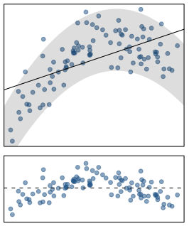

<style>
citation {
  <!-- font-size: 4px; -->
}
</style>

<!--  Version 1.0-0

      This version of the slides is adapted from Mine Çetinkaya-Rundel's lecture slides
      posted on OpenIntro.org in PDF (LaTeX) format, and moved to Rmd. Topic of Chapter 7
      of OpenIntro Statistics & Randomization, Probability. Moved into the OpenIntro Statistics
      coverage 2018.

      A large part of the HTML/CSS formatting is janky, and could be cleaned up. Feel free to issue a
      pull request if you love HTML and CSS and want to fix this up.

-->

<!--
<center>
```{r, out.width = "800px", echo = FALSE}
knitr::include_graphics("fig/fig_1_7_boxplots.png")
```
</center>-->

```{r echo=FALSE, message = FALSE, warning = FALSE}
poverty = read.table("poverty.txt", h = T, sep = "\t")
library(openintro)
data(COL)
```

# Statistics

## Transition

In the first few lectures, we discussed some aspects of statistics (data, variable types,
sampling concerns, and experimental design). We also touched on some aspects of plotting,
which we then used in workshops.

Then we went off on a seeming tangent, and talked about probability for a while!

Now, we're back to statistics, and will stay with it for the rest of the semester.

## Data and Modeling

In science, we often obtain data from experiments or observational studies, and then are
interested in **modeling** it. How we model it varies from field to field, but underlying
many of the models used in science are **statistical models**. In this lecture, we will
be examining one of the foundational models used all through every scientific field.

The material for this lecture comes from Chapters 2.1.1 and 8.

# Line fitting, residuals, and correlation

## Modeling numerical variables

We will begin by quantifying the relationship between two numerical variables, 
as well as modeling numerical response variables using a numerical or 
categorical explanatory variable. The model is therefore "find the relationship
between two variables".

## Poverty vs. HS graduate rate

<div style= "float:left; position: relative; top:-20px; right:10px;">
```{r povScatter, out.width = "500px", echo = FALSE}
par(mar=c(4,4,1,1), las=1, mgp=c(2.5,0.7,0), cex.lab = 1.5, cex.axis = 1.5)
plot(poverty$Poverty ~ poverty$Graduates, ylab = "% in poverty", 
     xlab = "% HS grad", pch = 19, col = COL[1,2])
```
</div>
<div style = "float:right; position: relative">
This **scatterplot** shows the relationship between HS graduate rate in 
all 50 US states and DC and the \% of residents who live below the poverty line 
(income below \$23,050 for a family of 4 in 2012).
</div>

## Poverty vs. HS graduate rate (code)

```{r povScatter2, out.width = "500px"}
par(mar=c(4,4,1,1), las=1, mgp=c(2.5,0.7,0), cex.lab = 1.5, cex.axis = 1.5)
plot(poverty$Poverty ~ poverty$Graduates, ylab = "% in poverty", 
     xlab = "% HS grad", pch = 19, col = COL[1,2])
```

## Poverty vs. HS graduate rate

* **Response variable?**
* **Explanatory variable?**
* **Relationship?**

## Poverty vs. HS graduate rate

* **Response variable?** \% in poverty
* **Explanatory variable?** \% HS grad
* **Relationship?** linear, negative, moderately strong

## Quantifying the relationship

* **Correlation** describes the strength of the *linear* association between two variables.
* It takes values between -1 (perfect negative) and +1 (perfect positive).
* A value of 0 indicates no linear association.

## Guessing the correlation

<div style= "float:left; position: relative;">
```{r povLine, echo = FALSE, out.width = 500}
par(mar=c(4,4,1,1), las=1, mgp=c(2.5,0.7,0), cex.lab = 1.5, cex.axis = 1.5)
plot(poverty$Poverty ~ poverty$Graduates, ylab = "% in poverty", xlab = "% HS grad", pch=19, col=COL[1,2])
lm_pov_grad = lm(poverty$Poverty ~ poverty$Graduates)
abline(lm_pov_grad, col = COL[4], lwd = 3)
```
</div>
<div style= "float:right; position:relative; inline:block;">
**Which of the following is the best guess for the correlation between \% in poverty and \% HS grad?**

0.6 &nbsp; -0.75 &nbsp; -0.1 &nbsp;  0.02 &nbsp; -1.5
</div>

## Guessing the correlation

<div style= "float:left; position: relative;">
```{r povNoHus, out.width = 400}
# scatterplot, %poverty vs.%no husband
par(mar=c(4,4,1,1), las=1, mgp=c(2.5,0.7,0), cex.lab = 1.5, cex.axis = 1.5)
plot(poverty$Poverty ~ poverty$PercentFemaleHouseholderNoHusbandPresent, ylab = "% in poverty", xlab = "% female householder, no husband present", pch=19, col=COL[1,2])
```
</div>
<div style= "float:right; position:relative; inline:block;">
**Which of the following is the best guess for the correlation between \% in poverty and \% female householder (no husband present)?**

0.1 &nbsp; -0.6 &nbsp; -0.4 &nbsp;  0.9 &nbsp; 0.5
</div>

## Assessing the correlation


```{r, echo = FALSE}
set.seed(179)

# 4 scatterplots

x = seq(0,10,0.1)
yNonLin = (x-3)^2 - 4 + rnorm(length(x), mean = 0, sd = 1)
yPosLinStrong = 3*x + 10 + rnorm(length(x), mean = 0, sd = 2)
yPosLinWeak = 3*x + 10 + rnorm(length(x), mean = 0, sd = 20)
yNegLinWeak = -3*x + 10 + rnorm(length(x), mean = 0, sd = 5)
```

<div style= "float:left; position: relative;">
```{r, out.width = 500, echo = FALSE}
par(mar=c(2,1,1,1), las=1, mgp=c(0.5,0.7,0), mfrow = c(2,2), 
    cex.lab = 1.5, cex.axis = 1.5)
plot(yNonLin ~ x, ylab = "", xlab = "(a)", pch=19, 
     col=COL[1,2], axes = FALSE)
box()
plot(yPosLinStrong ~ x, ylab = "", xlab = "(b)", pch=19, 
     col=COL[1,2], axes = FALSE)
box()
plot(yPosLinWeak ~ x, ylab = "", xlab = "(c)", pch=19, 
     col=COL[1,2], axes = FALSE)
box()
plot(yNegLinWeak ~ x, ylab = "", xlab = "(d)", pch=19, 
     col=COL[1,2], axes = FALSE)
box()
```
</div>
<div style= "float:right; position:relative; inline:block;">
**Which of the given plots has the strongest correlation, i.e., correlation coefficient closest to +1 or -1?**
</div>

## Answer

```{r, echo = FALSE}
cor_fig_a <- cor(yNonLin, x)
cor_fig_b <- cor(yPosLinStrong, x)
cor_fig_c <- cor(yPosLinWeak, x)
cor_fig_d <- cor(yNegLinWeak, x)
```

Correlation means **linear** association, and the strongest linear
association is Figure (b). We can actually **compute** the correlations,
and they are:

* `r round(cor_fig_a, 3)` (a) 
* `r round(cor_fig_b, 3)` (b) 
* `r round(cor_fig_c, 3)` (c)
* `r round(cor_fig_d, 3)` (d) 

We'll show you how to do this in workshop!

# Fitting a line by least squares regression

## Eyeballing the line

<div style= "float:left; position: relative;">
```{r echo=FALSE}
par(mar=c(4,4,1,1), las=1, mgp=c(2.5,0.7,0), cex.lab = 1.5, cex.axis = 1.5)
plot(poverty$Poverty ~ poverty$Graduates, ylab = "% in poverty", 
     xlab = "% HS grad", pch=19, col=COL[1,2])
mod <- lm(poverty$Poverty ~ poverty$Graduates)
abline(mod, col = COL[4], lwd = 3, lty = 1)
y1 = mod$coefficients[1] + 2 + (1.1 * mod$coefficients[2]) * poverty$Graduates
abline(lm(y1 ~ poverty$Graduates), lwd = 3, col = COL[2], lty = 2)
abline(h = 14, lwd = 3, col = COL[5], lty = 3)
y2 = 114 - (12/10) * seq(70,100,1)
abline(lm(y2 ~ seq(70,100,1)), lwd = 3, col = COL[3], lty = 4)
legend("topright", inset = 0.05, c("(a)","(b)","(c)", "(d)"), 
       col = c(COL[4],COL[2],COL[5],COL[3]), lwd = 3, lty = c(1,2,3,4))
```
</div>

<div style= "float:right; position:relative; inline:block;">
**Which of the lines on the figure appears to be the line that best fits the linear relationship between \% in poverty and \% HS grad? Choose one.**
</div>

## Residuals

**Residuals** are the leftovers from the model fit: Data = Fit + Residual

```{r echo = FALSE}
par(mar=c(4,4,1,1), las=1, mgp=c(2.5,0.7,0), cex.lab = 1.5, cex.axis = 1.5)
plot(poverty$Poverty ~ poverty$Graduates, ylab = "% in poverty", 
     xlab = "% HS grad", pch=19, col=COL[1,2])
lm_pov_grad = lm(poverty$Poverty ~ poverty$Graduates)
pred = predict(lm_pov_grad)
x = poverty$Graduates
for(i in 1:length(pred)){
  lines(c(x[i],x[i]), c(poverty$Poverty[i],pred[i]), col = COL[2])
}
abline(lm_pov_grad, col = COL[4], lwd = 3)
```
</div>

## Residuals (cont.)

Formally, residuals are the difference between the 
observed ($y_i$) and predicted $\hat{y}_i$. 

$$
e_i = y_i - \hat{y}_i
$$


## Specific Residuals

```{r, echo = FALSE}
par(mar=c(4,4,1,1), las=1, mgp=c(2.5,0.7,0), cex.lab = 1.5, cex.axis = 1.5)

plot(poverty$Poverty ~ poverty$Graduates, ylab = "% in poverty", xlab = "% HS grad", pch=19, col=COL[1,2])
lm_pov_grad = lm(poverty$Poverty ~ poverty$Graduates)

pred = predict(lm_pov_grad)
x = poverty$Graduates

for(i in c(9,40)){
  lines(c(x[i],x[i]), c(poverty$Poverty[i],pred[i]), col = COL[2])
  text(x[i]+0.5, poverty$Poverty[i], "y", cex = 1.5, col = "blue")
  text(x[i]+1.2, mean(c(poverty$Poverty[i],pred[i])), as.character(round(poverty$Poverty[i] - pred[i],2)), cex = 1.5, col = "orange")
  text(x[i]-0.5, pred[i], expression(hat(y)), cex = 1.5, col = COL[4])
}
text(x[9], poverty$Poverty[9] + 0.5, "DC", col = COL[2])
text(x[40], poverty$Poverty[40] - 0.5, "RI", col = COL[2])

abline(lm_pov_grad, col = COL[4], lwd = 3)
```

* \% living in poverty in DC is 5.44\% more than predicted.
* \% living in poverty in RI is 4.16\% less than predicted.


## A measure for the best line

* We want a line that has small residuals:
    - Option 1: Minimize the sum of magnitudes (absolute values) of residuals
$$
|e_1| + |e_2| + \cdots + |e_n|
$$
    - Option 2: Minimize the sum of squared residuals -- **least squares**
$$
e_1^2 + e_2^2 + \cdots + e_n^2
$$
    - Option 3 ... 100: actual topics of research!
* Why least squares?
    - Most commonly used
    - Easier to compute by hand and using software
    - In many applications, a residual twice as large as another is 
    usually more than twice as bad

## The least squares line

$$
\hat{y} = \beta_0 + \beta_1 x
$$

**Notation:**

* Intercept:
    - Parameter: $\beta_0$ 
    - Point estimate: $b_0$ 
* Slope:
    - Parameter: $\beta_1$ 
    - Point estimate: $b_1$ 

## The least squares line

```{r}
mod <- lm(Poverty ~ Graduates, data = poverty)
summary(mod)
```

## Slope

The **slope** of the regression can be calculated as 
$$
b_1 = \frac{s_y}{s_x} R
$$
but we will just use R, and identify it from the summary table:
```{r}
mod$coefficients
```

(so $b_1 = -0.62$)

**Interpretation**
For each additional \% point in HS graduate rate, we would expect the \% living in poverty to be lower on average by 0.62\% points.

## Intercept

The **intercept** is where the regression line intersects the $y$-axis. The calculation of the intercept uses the fact the a regression line always passes through $(\bar{x},\bar{y})$:
$$
b_0 = \bar{y} - b_1 \bar{x},
$$
but again, we will just use R and identify it:
```{r}
mod$coefficients
```
(so $b_0 = 64.78$). 

## Intercept

```{r, echo = FALSE}
par(mar=c(4,4,1,1), las=1, mgp=c(2.5,0.7,0), cex.lab = 1.5, cex.axis = 1.5)
plot(poverty$Poverty ~ poverty$Graduates, ylab = "% in poverty", xlab = "% HS grad", pch=19, col=COL[1,2], xlim = c(0,100), ylim = c(0,70))
lm_pov_grad = lm(poverty$Poverty ~ poverty$Graduates)
abline(lm_pov_grad, col = COL[4], lwd = 3)
abline(v = 0)
text(y = lm_pov_grad$coefficient[1]+3, x = 9, "intercept", cex = 1.5, col = COL[1])
```

## $\;$

**Which of the following is the correct interpretation of the intercept?**

* For each \% point increase in HS graduate rate, \% living in poverty is expected to increase on average by 64.68\%.
* For each \% point decrease in HS graduate rate, \% living in poverty is expected to increase on average by 64.68\%.
* Having no HS graduates leads to 64.68\% of residents living below the poverty line.
* States with no HS graduates are expected on average to have 64.68\% of residents living below the poverty line.
* In states with no HS graduates \% living in poverty is expected to increase on average by 64.68\%.

## More on the intercept

Since there are no states in the dataset with no HS graduates, the intercept is of no interest, not very useful, and also not reliable since the predicted value of the intercept is so far from the bulk of the data.

(see previous figure)

## Regression line

$$
\widehat{\%~in~poverty} = 64.68 - 0.62~\%~HS~grad
$$

```{r, out.width = 400}
par(mar=c(4,4,1,1), las=1, mgp=c(2.5,0.7,0), cex.lab = 1.5, cex.axis = 1.5)
plot(poverty$Poverty ~ poverty$Graduates, ylab = "% in poverty", 
     xlab = "% HS grad", pch=19, col=COL[1,2])
lm_pov_grad = lm(Poverty ~ Graduates, data = poverty)
abline(lm_pov_grad, col = COL[4], lwd = 3)
```

## Interpretation of slope and intercept

* **Intercept:** When $x = 0$, $y$ is expected to equal the intercept. 
* **Slope:** For each unit in $x$, $y$ is expected to increase / decrease on average by the slope.

<center>
```{r, out.width = "500px", echo = FALSE}

```
</center>

**These statements are not causal, unless the study is a randomized controlled experiment.**


# Prediction \& extrapolation

## Prediction

* Using the linear model to predict the value of the response variable for a given value of the explanatory variable is called **prediction**, simply by plugging in the value of $x$ in the linear model equation.
* There will be some uncertainty associated with the predicted value.

<center>
```{r, echo = FALSE, out.width = 450}
par(mar=c(4,4,1,1), las=1, mgp=c(2.5,0.7,0), cex.lab = 1.5, cex.axis = 1.5)

plot(poverty$Poverty ~ poverty$Graduates, ylab = "% in poverty", xlab = "% HS grad", pch=19, col=COL[1,2])
lm_pov_grad = lm(poverty$Poverty ~ poverty$Graduates)
abline(lm_pov_grad, col = COL[4], lwd = 3)
lines(x = c(82,82), y = c(0,64.781-0.6212*82), lty = 3)
lines(x = c(0,82), y = c(64.781-0.6212*82,64.781-0.6212*82), lty = 3)
```
</center>

## Extrapolation

* Applying a model estimate to values outside of the realm of the original data is called **extrapolation**.

* Sometimes the intercept might be an extrapolation.

<center>
```{r, echo = FALSE, out.width = 550}
par(mar=c(4,4,1,1), las=1, mgp=c(2.5,0.7,0), cex.lab = 1.5, cex.axis = 1.5)

plot(poverty$Poverty ~ poverty$Graduates, ylab = "% in poverty", xlab = "% HS grad", pch=19, col=COL[1,2], xlim = c(0,100), ylim = c(0,70))
lm_pov_grad = lm(poverty$Poverty ~ poverty$Graduates)
abline(lm_pov_grad, col = COL[4], lwd = 3)
abline(v = 0)
text(y = lm_pov_grad$coefficient[1]+3, x = 7, "intercept", cex = 1.5, col = COL[1])
```
</center>

## Examples of extrapolation

<center>
```{r, out.width = "800px", echo = FALSE}
knitr::include_graphics("fig/extrapolation.png")
```
</center>

## Examples of extrapolation

<center>
```{r, out.width = "800px", echo = FALSE}
knitr::include_graphics("fig/womenOutsprint.png")
```
</center>

## $\;$

<center>
```{r, out.width = "800px", echo = FALSE}
knitr::include_graphics("fig/womenOutsprintBBC.png")
```
</center>


## Conditions for the least squares line

* Linearity
* Nearly normal residuals
* Constant variability

## Conditions: (1) Linearity

* The relationship between the explanatory and the response variable should be linear. 
* Methods for fitting a model to non-linear relationships exist, but are beyond the scope of this class. One such method will be discussed in MATH 1052H.
* Check using a scatterplot of the data, or a **residuals plot**.

## Conditions: (1) Linearity (Examples)

<center>
```{r, echo = FALSE}
library(openintro)
COL <- c('#22558899', '#000000CC')
set.seed(1)
par(mfrow=2:3, mar=rep(0.5, 4))
MyLayOut <- matrix(1:6, 2)
nf <- layout(mat=MyLayOut, widths=c(2,2,2), heights=c(2,1), respect=TRUE)

n <- c(25)
x <- runif(n[1])
y <- -8*x + rnorm(n[1])
plot(x,y, axes=FALSE, pch=20, col=COL[1], cex=1.202, xlim=c(-0.03, 1.03), ylim=c(-10, 1))
box()
g <- lm(y~x)
abline(g, col=COL[2])
plot(x, summary(g)$residuals, pch=20, col=COL[1], cex=1.202, xlim=c(-0.03, 1.03), axes=FALSE, ylim=2.5*c(-1,1)*max(abs(summary(g)$residuals)))
box()
abline(h=0, col=COL[2], lty=2)

n <- 30
x <- c(runif(n[1]-2, 0, 4), 2, 2.1)
y <- -2*x^2 + rnorm(n[1])
plot(x,y, axes=FALSE, pch=20, col=COL[1], cex=1.202, xlim=c(-0.2, 4.2), ylim=c(-35, 2))
box()
g <- lm(y~x)
abline(g, col=COL[2])
plot(x, summary(g)$residuals, pch=20, col=COL[1], cex=1.202, xlim=c(-0.2, 4.2), axes=FALSE, ylim=1.8*c(-1,1)*max(abs(summary(g)$residuals)))
box()
abline(h=0, col=COL[2], lty=2)

n <- 40
x <- runif(n[1])
y <- 0.2*x + rnorm(n[1])
y[y < -2] <- -1.5
plot(x,y, axes=FALSE, pch=20, col=COL[1], cex=1.202, xlim=c(-0.03, 1.03), ylim=c(-2, 2))
box()
g <- lm(y~x)
abline(g, col=COL[2])
plot(x, summary(g)$residuals, pch=20, col=COL[1], cex=1.202, xlim=c(-0.03, 1.03), axes=FALSE, ylim=1.2*c(-1,1)*max(abs(summary(g)$residuals)))
box()
abline(h=0, col=COL[2], lty=2)
```
</center>

## Anatomy of a residuals plot

```{r, echo = FALSE, out.width = 400}
data(COL)
par(mar=c(4,4,1,1), las=1, mgp=c(2.5,0.5,0), cex.lab = 1.25, cex.axis = 1.25, mfrow = c(2,1))

lmPlot(x = poverty$Graduates, y = poverty$Poverty, highlight = c(9,40), hlCol = c(COL[4],COL[2]), hlPch = c(15,17), col = COL[1,2], ylab = "% in poverty", xlab = "% HS grad", lCol = COL[4], lwd = 2, xAxis = 4)
```

**RI**: \% HS grade (81), \% poverty (10.3)

$$
\widehat{\%~in~poverty} = 64.68 - 0.62 * 81 = 14.46\\
e = \%~in~poverty - \widehat{\%~in~poverty} \\
e = 10.3 - 14.46 = -4.16 \\
$$


## Conditions: (2) Nearly normal residuals

* The residuals should be nearly normal.
* This condition may not be satisfied when there are unusual observations that don't follow the trend of the rest of the data.
* Check using a histogram or normal probability plot of residuals.

## Conditions: (2) Nearly normal residuals

```{r, out.width = 550}
par(mfrow=c(1,2))
histPlot(lm_pov_grad$residuals, col = COL[1], xlab = "residuals")
qqnorm(lm_pov_grad$residuals, pch = 19, col = COL[1,2])
qqline(lm_pov_grad$residuals, pch = 19, col = COL[1])
```

## Conditions: (3) Constant variability

```{r, echo = FALSE, out.width = 400}
layout(matrix(1:2, 2), c(1,1), c(2,1))
par(mar=c(4,4,1,1))

plot(x = poverty$Graduates, y = poverty$Poverty, ylab = "% in poverty", xlab = "% HS grad", pch=19, col=COL[1,2])
makeTube(x = poverty$Graduates, y = poverty$Poverty)

plot(x = poverty$Graduates, y = lm_pov_grad$residuals, pch=19, col=COL[1,2], ylab = "", xlab = "", axes = FALSE, ylim = c(-5.5,5.5))
makeTube(x = poverty$Graduates, y = lm_pov_grad$residuals, addLine = FALSE)
axis(1, at = c(80,90,95))
axis(2, at = c(-4, 0, 4))
box()
abline(h = 0, lty = 2)
```

* The variability of points around the least squares line should be roughly constant.
* This implies that the variability of residuals around the 0 line should be roughly constant as well.
* Also called **homoscedasticity**.
* Check using a histogram or normal probability plot of residuals.

## Checking conditions

<div style= "float:left; position: relative; top:-20px; right:10px;">
<center>
```{r, out.width = "300px", echo = FALSE}

```
</center>
</div>
<div style = "float:right; position: relative">
What condition is this linear model obviously violating?

* Constant variability
* Linear relationship
* Normal residuals
* No extreme outliers
</div>

## Checking conditions

<div style= "float:left; position: relative; top:-20px; right:10px;">
<center>
```{r, out.width = "300px", echo = FALSE}

```
</center>
</div>
<div style = "float:right; position: relative">
What condition is this linear model obviously violating?

* Constant variability
* Linear relationship
* Normal residuals
* No extreme outliers
</div>

## $R^2$

* The strength of the fit of a linear model is most commonly evaluated using $R^2$
* $R^2$ is calculated as the square of the correlation coefficient.
* It tells us what percent of variability in the response variable is explained by the model.
* The remainder of the variability is explained by variables not included in the model or by inherent randomness in the data.
* For the model we've been working with, $R^2 = -0.62^2 = 0.38$.

## Interpretation of $R^2$

**Which of the below is the correct interpretation of $R = -0.62$, $R^2 = 0.38$?**

* 38\% of the variability in the \% of HG graduates among the 51 states is explained by the model.
* 38\% of the variability in the \% of residents living in poverty among the 51 states is explained by the model.
* 38\% of the time \% HS graduates predict \% living in poverty correctly.
* 62\% of the variability in the \% of residents living in poverty among the 51 states is explained by the model.

<center>
```{r, echo = FALSE, out.width = 350}
par(mar=c(4,4,1,1), las=1, mgp=c(2.5,0.7,0), cex.lab = 1.5, cex.axis = 1.5)
plot(poverty$Poverty ~ poverty$Graduates, ylab = "% in poverty", xlab = "% HS grad", pch=19, col=COL[1,2])
```
</center>

## To Come

We now have our first statistical model. In the coming lectures, we will
talk about what this model means, how we use it, and how we can determine
uncertainty in the model (since it is statistical, after all!).