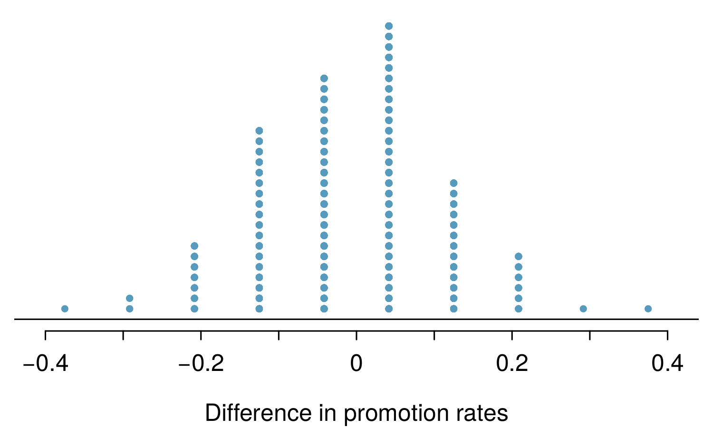

<style>
citation {
  font-size: 4px;
}
</style>

<!--  Version 1.0-0

      This version of the slides is adapted from Mine Çetinkaya-Rundel's lecture slides
      in .tex format for the Open Intro Statistics text, with some modifications, and
      moved to Rmd -> HTML.

      A large part of the HTML/CSS formatting is janky, and could be cleaned up. Feel free to issue a 
      pull request if you love HTML and CSS and want to fix this up.

      - wburr, Oct 17, 2018
-->

<!-- This is Chapter 2.1 in the IntroStat text, slides by Mine Cetinkaya-Rundel -->
# Case Study: Gender Discrimination

## Gender Discrimination

* In 1972, as a part of a study on gender discrimination, 48 male bank supervisors were each given the same personnel file and asked to judge whether the person should be promoted to a branch manager job that was described as “routine”.
* The files were identical except that half of the supervisors had files showing the person was male while the other half had files showing the person was female.
* It was randomly determined which supervisors got “male” applications and which got “female” applications.
* Of the 48 files reviewed, 35 were promoted.
* The study is testing whether females are unfairly discriminated against.
* Is this an observational study or an experiment?


<span style="font-size:10pt;">*B.Rosen and T. Jerdee (1974), "Influence of sex role stereotypes on personnel decisions", J.Applied Psychology, 59:9-14.*</span>

## Data

At a first glance, does there appear to be a relationship between promotion and gender?

```{r, makeOutcomeTable2_1, echo = FALSE}
library("kableExtra")
library("knitr")
options(knitr.table.format = "html") 
dt <- data.frame("Yes" = c(21, 14, 35), "No" = c(3, 10, 13), "Total" = c(24, 24, 48))
row.names(dt) <- c("Male", "Female", "")
kable(dt, align = 'ccc') %>%
  kable_styling("striped", full_width = FALSE, position = "center", font_size = 20) %>%
  add_header_above(c(" " = 1, "Promoted" = 2, " " = 1)) %>%
  group_rows("Gender", 1, 2) %>%
  group_rows("Total", 3, 3)
```

**% of males promoted**: 21 / 24 = 0.875

**% of females promoted**: 14 / 24 = 0.583

## Practice

We saw a difference of almost 30% (29.2% to be exact) between the proportion of male and female files that are promoted. Based on this information, which of the below is true?

1. If we were to repeat the experiment we will definitely see that more female files get promoted. This was a fluke.
2. Promotion is dependent on gender, males are more likely to be promoted, and hence there is gender discrimination against women in promotion decisions.
3. The difference in the proportions of promoted male and female files is due to chance, this is not evidence of gender discrimination against women in promotion decisions.
4. Women are less qualified than men, and this is why fewer females get promoted.

## Practice

We saw a difference of almost 30% (29.2% to be exact) between the proportion of male and female files that are promoted. Based on this information, which of the below is true?

1. If we were to repeat the experiment we will definitely see that more female files get promoted. This was a fluke.
2. <span id="highlight">Promotion is dependent on gender, males are more likely to be promoted, and hence there is gender discrimination against women in promotion decisions.</span>  <span style="color:red;">Maybe!</span>
3. <span id="highlight">The difference in the proportions of promoted male and female files is due to chance, this is not evidence of gender discrimination against women in promotion decisions.</span>  <span style="color:red;">Maybe!</span>
4. Women are less qualified than men, and this is why fewer females get promoted.

## Two Competing Claims

<div style="font-size:22px;">
“There is nothing going on.” (**Null Hypothesis**)

Promotion and gender are **independent**.

No gender discrimination.

Observed difference in proportions is simply due to chance.

<hr>
<center>**versus**</center>
<hr>

There is something going on.” (**Alternative Hypothesis**)

Promotion and gender are **dependent**.

There is gender discrimination.

Observed difference in proportions is not due to chance.
</div>

## We Will Return!

We will continue with the concept of hypothesis testing later in this lecture, 
and over the following weeks. 
First, lets develop some other ideas.

# Variability in estimates

## $\;$
<div style = "margin-top: -90px;">
<center>
<br />
<br />
<br />
</center>
</div>

<center>
<span style="font-size:10pt; font-style: oblique; ">http://pewresearch.org/pubs/2191/young-adults-workers-labor-market-pay-careers-advancement-recession</span>
</center>

## Margin of error

<center>

</center>

* 41% $\pm$ 2.9%: We are 95% confident that 38.1% to 43.9% of the public believe young adults, rather than middle-aged or older adults, are having the toughest time in today's economy.
* 49% $\pm$ 4.4%: We are 95% confident that 44.6% to 53.4% of 18-34 years olds have taken a job they didn't want just to pay the bills.

## Parameter estimation

* We are often interested in **population parameters**.
* Since complete populations are difficult (or impossible) to collect data on, we use **sample statistics** as **point estimates** for the unknown population parameters of interest.
* Sample statistics vary from sample to sample.
* Quantifying how sample statistics vary provides a way to estimate the **margin of error** associated with our point estimate.
* But before we get to quantifying the variability among samples, let's try to understand how and why point estimates vary from sample to sample.

## Parameter estimation

Suppose we randomly sample 1,000 adults from each state in the US. Would
you expect the sample means of their heights to be the same, somewhat different, or very different?

**Not the same, but only somewhat different.**


## $\;$

<div style="margin-top: -100px;">
The following histogram shows the distribution of number of drinks it takes a group of college students to get drunk. We will assume that this is our population of interest. If we randomly select observations from this data set, which values are most likely to be selected (which are least likely)?

<center>

</center>
</div>

## $\;$

<div style="margin-top: -100px;">
Suppose that you don't have access to the population data. In order to estimate the average number of drinks it takes these college students to get drunk, you might sample from the population and use your sample mean as the best guess for the unknown population mean.

* Sample, with replacement, ten students from the population, and record the number of drinks it takes them to get drunk.
* Find the sample mean.
* Plot the distribution of the sample averages  obtained by members of the class.

</div>

## $\;$

<center>

</center>

## $\;$

**Example:** List of random numbers: 59, 121,  88,  46,  58,  72,  82,  81,   5,  10 

<center>

</center>
<br/>

**Sample mean**: $\frac{8+6+10+4+5+3+5+6+6+6}{10} = 5.9$

## Sampling distribution

What you just constructed is called a *sampling distribution*.

What is the shape and center of this distribution? Based on this distribution, what do you think is the true population average?

## Sampling distribution

What you just constructed is called a *sampling distribution*.

What is the shape and center of this distribution? Based on this distribution, what do you think is the true population average?

**Approximately 5.39, the true population mean.**

# Sampling distributions - via CLT

## Central limit theorem

**Central limit theorem**
The distribution of the sample mean is well approximated by a normal model:
$$
\bar{x} \sim \mathcal{N} \left(\text{mean} = \mu, \text{SE} = \frac{\sigma}{\sqrt{n}} \right),
$$
where SE is represents **standard error**, which is defined as the standard deviation of the sampling distribution. If $\sigma$ is unknown, use $s$ (recall: standard deviation of sample).

## Central limit theorem

* It wasn't a coincidence that the sampling distribution we saw earlier was symmetric, and centered at the true population mean.
* We won't go through a detailed proof of why $SE =  \frac{\sigma}{\sqrt{n}}$, but note that as $n$ increases $SE$ decreases. 
    - As the sample size increases we would expect samples to yield more consistent sample means, hence the variability among the sample means would be lower.

## CLT - conditions

Certain conditions must be met for the CLT to apply:

* **Independence:** Sampled observations must be independent. 
This is difficult to verify, but is more likely if
    - random sampling/assignment is used, and
    - if sampling without replacement, $n$ $<$ 10\% of the population.

## CLT - conditions

Certain conditions must be met for the CLT to apply:

* **Independence:** Sampled observations must be independent. 
This is difficult to verify, but is more likely if
    - random sampling/assignment is used, and
    - if sampling without replacement, $n$ $<$ 10\% of the population.
* **Sample size/skew:** Either the population distribution is normal, or if the population distribution is skewed, the sample size is large.
This is also difficult to verify for the population, but we can check it using the sample data, and assume that the sample mirrors the population.
    - the more skewed the population distribution, the larger sample size we need for the CLT to apply
    - for moderately skewed distributions $n>30$ is a widely used rule of thumb

# Hypothesis Testing

## Hypothesis Tests as a Trial
<span style="font-size:22px;">
Hypothesis testing is very much like a court trial.
<div style= "float:right;position: relative; top: -20px;">

```{r, echo=FALSE, out.width = "350px"}

```
</div>
<div style="position:relative; bottom:20px;">&nbsp;</div>
* $H_0$: defendent is innocent (English common law; Justinian Codes, UN Declaration of Human Rights), *versus* <br />
 $H_A$: defendent is guilty
* We then present the evidence $-$ collect data
* Then we judge the evidence: "Could these data plausibly have happened by chance if the null hypothesis were true?"
    * If they were very unlikely to have occurred, then the evidence raises more than *a reasonable doubt* in our minds about the null hypothesis
* Ultimately, we must make a decision: how unlikely is **unlikely**?
</span>

<center>
<span style="font-size:10pt;">*Image from http://www.nwherald.com/_internal/cimg!0/oo1il4sf8zzaqbboq25oevvbg99wpot</span>*</span>
</center>

## A Hypothesis Test as a Trial (continued)

* If the evidence is not strong enough to reject the assumption of innocence, the jury returns with a verdict of "not guilty".
    * The jury does not say that the defendant is innocent, just that there is not enough evidence to convict.
    * The defendant may, in fact, be innocent, but the jury has no way of being sure.
* Said statistically, we **fail to reject the null hypothesis**.
    * We never declare the null hypothesis to be true, because we simply do not know whether it's true or not.
    * Therefore we never "accept the null hypothesis".

## A Hypothesis Test as a Trial (continued)

* In a trial, the burden of proof is on the prosecution.
* In a hypothesis test, the burden of proof is on the unusual claim.
*  The null hypothesis is the ordinary state of affairs (the status quo), so it's the alternative hypothesis that we consider unusual and for which we must gather evidence.

## Recap: Concept of Hypothesis Testing 
* We start with a **null hypothesis** ($H_0$) that represents the status quo.
* We also have an **alternative hypothesis** ($H_A$) that represents our research question, i.e. what we're testing for.
* We conduct a hypothesis test under the assumption that the null hypothesis is true, either via simulation (today) or theoretical methods (later in the course).
* If the test results suggest that the data do not provide convincing evidence for the alternative hypothesis, we stick with the null hypothesis. If they do, then we reject the null hypothesis in favor of the alternative.

## Back to the example of gender discrimination ...

<center>

</center>

Since it was quite unlikely to obtain results like the actual data or something more extreme in the simulations (male promotions being 30% or more higher than female promotions), we would decide to reject the null hypothesis in favor of the alternative.

# Hypothesis Testing (Recap)

## Concept of Hypothesis Testing 

* We start with a **null hypothesis** ($H_0$) that represents the status quo.
* We also have an **alternative hypothesis** ($H_A$) that represents our research question, i.e. what we're testing for.
* We conduct a hypothesis test under the assumption that the null hypothesis is true, either via simulation (today) or theoretical methods (later in the course).
* If the test results suggest that the data do not provide convincing evidence for the alternative hypothesis, we stick with the null hypothesis. If they do, then we reject the null hypothesis in favor of the alternative.

# Formal testing using p-values

## Test statistic

In order to evaluate if the observed sample mean is unusual for the hypothesized sampling distribution, we determine how many standard errors away from the null it is, which is also called the test statistic.

<div style="display: inline-block; float: left; width: 50%;">

</div>
<div style="display: inline-block; float: right; width: 50%; text-align: right;">
$$
\bar{x} \sim N \left(\mu = 8, SE = \frac{7}{\sqrt{206}} \approx 0.5 \right) 
$$
$$
Z = \frac{9.7 - 8}{0.5} = 3.4
$$
</div>

The sample mean is 3.4 standard errors away from the hypothesized value. Is this considered unusually high? That is, is the result **statistically significant**?

## Test statistic

In order to evaluate if the observed sample mean is unusual for the hypothesized sampling distribution, we determine how many standard errors away from the null it is, which is also called the test statistic.

<div style="display: inline-block; float: left; width: 50%;">

</div>
<div style="display: inline-block; float: right; width: 50%; text-align: right;">
$$
\bar{x} \sim N \left(\mu = 8, SE = \frac{7}{\sqrt{206}} \approx 0.5 \right) 
$$
$$
Z = \frac{9.7 - 8}{0.5} = 3.4
$$
</div>

The sample mean is 3.4 standard errors away from the hypothesized value. Is this considered unusually high? That is, is the result **statistically significant**?

**Yes, and we can quantify how unusual it is using a p-value.**

## p-values

* We then use this test statistic to calculate the **p-value**, the probability of observing data at least as favorable to the alternative hypothesis as our current data set, if the null hypothesis were true.

## p-values

* We then use this test statistic to calculate the **p-value**, the probability of observing data at least as favorable to the alternative hypothesis as our current data set, if the null hypothesis were true.
* If the p-value is **low** (lower than the significance level, $\alpha$, which is usually 5\%) we say that it would be very unlikely to observe the data if the null hypothesis were true, and hence **reject $H_0$**.

## p-values

* We then use this test statistic to calculate the **p-value**, the probability of observing data at least as favorable to the alternative hypothesis as our current data set, if the null hypothesis were true.
* If the p-value is **low** (lower than the significance level, $\alpha$, which is usually 5\%) we say that it would be very unlikely to observe the data if the null hypothesis were true, and hence **reject $H_0$**.
* If the p-value is **high** (higher than $\alpha$) we say that it is likely to observe the data even if the null hypothesis were true, and hence **do not reject $H_0$**.

## Example: Number of university applications

A survey asked how many universities students applied to, and 206 students responded to this question. This sample yielded an average of 9.7 universitiy applications with a standard deviation of 7. A government website states that counselors recommend students apply to roughly 8 universities.  Do these data provide convincing evidence that the average number of universities all Trent students apply to is *higher* than recommended?

## Setting the hypotheses

* The **parameter of interest** is the average number of schools applied to by **all** Trent students.
* There may be two explanations why our sample mean is higher than the recommended 8 schools.
    - The true population mean is different.
    - The true population mean is 8, and the difference between the true population mean and the sample mean is simply due to natural sampling variability.

## Setting the hypotheses (ctd.)

* We start with the assumption the average number of schools Trent students apply to is 8 (as recommended)
$$
H_0:~\mu = 8
$$
* We test the claim that the average number of schools Trent students apply to is greater than 8
$$
H_A:~\mu > 8
$$

## Number of university applications - conditions

Which of the following is *not* a condition that needs to be met to proceed with this hypothesis test?

* Students in the sample should be independent of each other with respect to how many schools they applied to.
* Sampling should have been done randomly.
* The sample size should be less than 10% of the population of all Trent students.
* There should be at least 10 successes and 10 failures in the sample.
* The distribution of the number of schools students apply to should not be extremely skewed.

## Number of university applications - p-value

**p-value:** probability of observing data at least as favorable to $H_A$ as our current data set (a sample mean greater than 9.7), if in fact $H_0$ were true (the true population mean was 8).


$$
P(\bar{x} > 9.7~|~\mu = 8) = P(Z > 3.4) = 0.0003
$$

## Number of university applications - Making a decision

* *p*-value = 0.0003

## Number of university applications - Making a decision

* *p*-value = 0.0003
    - If the true average of the number of universities Trent students applied to is 8, there is only 0.03% chance of observing a random sample of 206 Trent students who on average apply to 9.7 or more schools.
    - This is a pretty low probability for us to think that a sample mean of 9.7 or more schools is likely to happen simply by chance.
    
## Number of university applications - Making a decision

* *p*-value = 0.0003
    - If the true average of the number of universities Trent students applied to is 8, there is only 0.03% chance of observing a random sample of 206 Trent students who on average apply to 9.7 or more schools.
    - This is a pretty low probability for us to think that a sample mean of 9.7 or more schools is likely to happen simply by chance.
* Since the *p*-value is **low** (lower than 5%) we **reject $H_0$**.

## Number of university applications - Making a decision

* *p*-value = 0.0003
    - If the true average of the number of universities Trent students applied to is 8, there is only 0.03% chance of observing a random sample of 206 Trent students who on average apply to 9.7 or more schools.
    - This is a pretty low probability for us to think that a sample mean of 9.7 or more schools is likely to happen simply by chance.
* Since the *p*-value is **low** (lower than 5%) we **reject $H_0$**.
* The data provide convincing evidence that Trent students apply to more than 8 schools on average.

## Number of university applications - Making a decision

* *p*-value = 0.0003
    - If the true average of the number of universities Trent students applied to is 8, there is only 0.03% chance of observing a random sample of 206 Trent students who on average apply to 9.7 or more schools.
    - This is a pretty low probability for us to think that a sample mean of 9.7 or more schools is likely to happen simply by chance.
* Since the *p*-value is **low** (lower than 5%) we **reject $H_0$**.
* The data provide convincing evidence that Trent students apply to more than 8 schools on average.
* The difference between the null value of 8 schools and observed sample mean of 9.7 schools is **not due to chance** or sampling variability.

## $\;$
<div style="margin-top: -100px; font-size: 24px;">
A poll by the National Sleep Foundation (USA) found that college students average about 7 hours of sleep per night. A sample of 169 college students taking an introductory statistics class yielded an average of 6.88 hours, with a standard deviation of  0.94 hours. Assuming that this is a random sample representative of all college students *(bit of a leap of faith?)*, a hypothesis test was conducted to evaluate if college students on average sleep **less than** 7 hours per night. The p-value for this hypothesis test is 0.0485. Which of the following is correct?

* Fail to reject $H_0$, the data provide convincing evidence that college students sleep less than 7 hours on average.
* Reject $H_0$, the data provide convincing evidence that college students sleep less than 7 hours on average. 
* Reject $H_0$, the data prove that college students sleep more than 7 hours on average.
* Fail to reject $H_0$, the data do not provide convincing evidence that college students sleep less than 7 hours on average.
* Reject $H_0$, the data provide convincing evidence that college students in this sample sleep less than 7 hours on average.
</div>

## Two-sided hypothesis testing with p-values

* If the research question was "Do the data provide convincing evidence that the average amount of sleep college students get per night is **different** than the national average?", the alternative hypothesis would be different.

$$
\begin{split}
H_0&: \mu = 7 \\
H_A&: \mu \ne 7
\end{split}
$$

## Two-sided hypothesis testing with p-values

* If the research question was "Do the data provide convincing evidence that the average amount of sleep college students get per night is **different** than the national average?", the alternative hypothesis would be different.
* Then the p-value **would change as well**:

<div style="display: inline-block; float: left; width: 50%;">
```{r, echo = FALSE, cache = TRUE, message = FALSE, error = FALSE, warning = FALSE, fig.height = 4}
library(openintro)
data(COL)
mu = 7
se = 0.94/sqrt(169)
normTail(m = mu, s = se, U = 7.12, L = 6.88, axes = FALSE, col = COL[1])
axis(1, at = c(mu-3*se, 6.88, 7, 7.12, mu+3*se), 
     labels = c(NA, expression(paste(bar(x), "= 6.88")),
                expression(paste(mu, "= 7")), 
                7.12 , NA), cex.axis = 1.5)
```
</div>
<div style="display: inline-block; float: right; width: 50%; text-align: right;">
p-value $= 0.0485 \times 2$ 
$= 0.097$
</div>

## Computing the *p*-value

How do we actually compute the *p*-value? We use **pnorm()**! There's a reason we made you learn about it!

**Example**: the **test statistic** is 2.3, with hypotheses
$$
H_0: \mu = 5 \qquad \text{versus} \qquad H_A: \mu > 5
$$
What is the *p*-value?

<center>
<div style="margin-top: -100px;">
```{r, echo = FALSE, fig.width = 5, fig.height=4}
x <- seq(-3.5, 3.5, 0.01)
plot(x, dnorm(x), type = "l", xlab = "z", ylab = "Normal Density")
abline(h = 0)
abline(v = 2.3, col = "red")
text(x = 0, y = 0.15, "??%")
text(x = 2.9, y = 0.15, "??%")
```
</div>
</center>

## Example, continued

```{r}
pnorm(2.3, mean = 0, sd = 1, lower.tail = FALSE)
```

So the *p*-value for this **one-tailed hypothesis test** is 0.011. What does this imply?

Since $0.011 < 0.05$, we do have evidence at the 95% level to reject the null hypothesis (whatever it is in context), and
conclude that $\mu > 5$.

## The Alternative Hypothesis ...

<center>

</center>

## Next

In the following lectures, we'll tie this idea of hypothesis testing together with
linear regression, and show you how it's all one big idea!