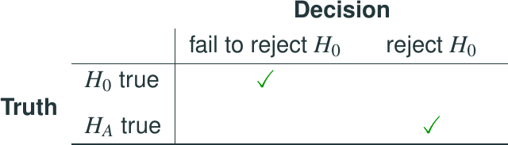
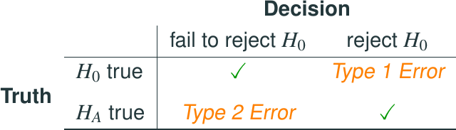
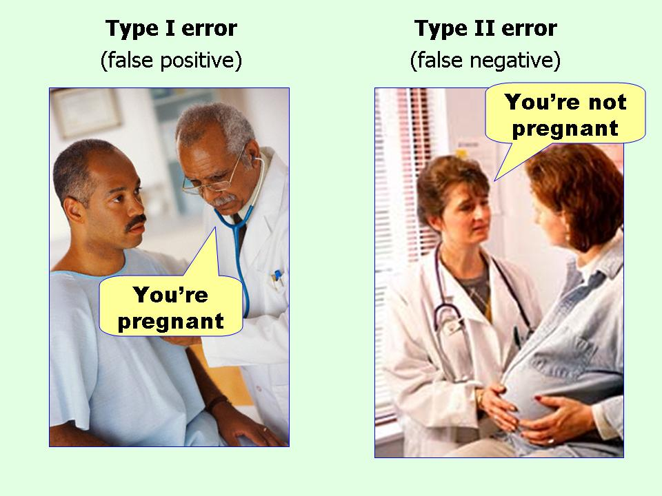

# Decision Errors

## Decision errors

* Hypothesis tests are not flawless.

## Decision errors

* Hypothesis tests are not flawless.
* In the court system innocent people are sometimes wrongly convicted and the guilty sometimes walk free.

## Decision errors

* Hypothesis tests are not flawless.
* In the court system innocent people are sometimes wrongly convicted and the guilty sometimes walk free.
* Similarly, we can make a wrong decision in statistical hypothesis tests as well. 

## Decision errors

* Hypothesis tests are not flawless.
* In the court system innocent people are sometimes wrongly convicted and the guilty sometimes walk free.
* Similarly, we can make a wrong decision in statistical hypothesis tests as well. 
* The difference is that we have the tools necessary to quantify how often we make errors in statistics.

## Decision errors (cont.)

There are two competing hypotheses: the null and the alternative. In a hypothesis test, we make a decision about which might be true, but our choice might be incorrect. 

## Decision errors (cont.)

There are two competing hypotheses: the null and the alternative. In a hypothesis test, we make a decision about which might be true, but our choice might be incorrect. 

## Decision errors (cont.)

There are two competing hypotheses: the null and the alternative. In a hypothesis test, we make a decision about which might be true, but our choice might be incorrect. 

* A **Type 1 Error** is rejecting the null hypothesis when $H_0$ is true.

## Decision errors (cont.)

There are two competing hypotheses: the null and the alternative. In a hypothesis test, we make a decision about which might be true, but our choice might be incorrect. 

* A **Type 1 Error** is rejecting the null hypothesis when $H_0$ is true.
* A **Type 2 Error** is failing to reject the null hypothesis when $H_A$ is true.

## Decision errors (cont.)

There are two competing hypotheses: the null and the alternative. In a hypothesis test, we make a decision about which might be true, but our choice might be incorrect. 

* A **Type 1 Error** is rejecting the null hypothesis when $H_0$ is true.
* A **Type 2 Error** is failing to reject the null hypothesis when $H_A$ is true.
* We (almost) never know if $H_0$ or $H_A$ is true, but we need to consider all possibilities.

## Hypothesis Test as a trial

If we again think of a hypothesis test as a criminal trial then it makes sense to frame the verdict in terms of the null and alternative hypotheses:
$$
\begin{split}
H_0&:\text{ Defendant is innocent} \\
H_A&:\text{ Defendant is guilty}
\end{split}
$$

Which type of error is being committed in the following circumstances?

## Hypothesis Test as a trial

If we again think of a hypothesis test as a criminal trial then it makes sense to frame the verdict in terms of the null and alternative hypotheses:
$$
\begin{split}
H_0&:\text{ Defendant is innocent} \\
H_A&:\text{ Defendant is guilty}
\end{split}
$$

Which type of error is being committed in the following circumstances?

* Declaring the defendant innocent when they are actually guilty
* Declaring the defendant guilty when they are actually innocent

## Hypothesis Test as a trial

If we again think of a hypothesis test as a criminal trial then it makes sense to frame the verdict in terms of the null and alternative hypotheses:
$$
\begin{split}
H_0&:\text{ Defendant is innocent} \\
H_A&:\text{ Defendant is guilty}
\end{split}
$$

Which type of error is being committed in the following circumstances?

* Declaring the defendant innocent when they are actually guilty
    - **Type 2 error**
* Declaring the defendant guilty when they are actually innocent
    - **Type 1 error**

## Hypothesis Test as a trial

If we again think of a hypothesis test as a criminal trial then it makes sense to frame the verdict in terms of the null and alternative hypotheses:
$$
\begin{split}
H_0&:\text{ Defendant is innocent} \\
H_A&:\text{ Defendant is guilty}
\end{split}
$$

Which type of error is being committed in the following circumstances?

* Declaring the defendant innocent when they are actually guilty
    - **Type 2 error**
* Declaring the defendant guilty when they are actually innocent
    - **Type 1 error**

Which error do you think is the worse error to make?

## Hypothesis Test as a trial

https://en.wikipedia.org/wiki/Blackstone%27s_ratio

## Another way to remember

## Another way to remember

For these medical diagnoses, what is happening?

* Null hypothesis is always "nothing going on": so a **medical test** for pregnancy should have its null as "Not Pregnant"

## Another way to remember

For these medical diagnoses, what is happening?

* Null hypothesis is always "nothing going on": so a **medical test** for pregnancy should have its null as "Not Pregnant"
* So for the man in the left panel, being told "you are pregnant" means **reject the null** - select the alternative. 

## Another way to remember

For these medical diagnoses, what is happening?

* Null hypothesis is always "nothing going on": so a **medical test** for pregnancy should have its null as "Not Pregnant"
* So for the man in the left panel, being told "you are pregnant" means **reject the null** - select the alternative. 
    - this is obviously incorrect

## Another way to remember

For these medical diagnoses, what is happening?

* Null hypothesis is always "nothing going on": so a **medical test** for pregnancy should have its null as "Not Pregnant"
* So for the man in the left panel, being told "you are pregnant" means **reject the null** - select the alternative. 
    - this is obviously incorrect    
    - therefore it is **false**
   
## Another way to remember

For these medical diagnoses, what is happening?

* Null hypothesis is always "nothing going on": so a **medical test** for pregnancy should have its null as "Not Pregnant"
* So for the man in the left panel, being told "you are pregnant" means **reject the null** - select the alternative. 
    - this is obviously incorrect    
    - therefore it is **false** 
    - but the diagnosis was "positive" (the alternative)
    - this is equivalent to **declaring the defendent guilty, when they are actually innocent**

## Another way to remember

For these medical diagnoses, what is happening?

* Null hypothesis is always "nothing going on": so a **medical test** for pregnancy should have its null as "Not Pregnant"
* So for the woman in the right panel, being told "you are not pregnant" means **fail to reject the null** - there is no evidence
against the null state

## Another way to remember

For these medical diagnoses, what is happening?

* Null hypothesis is always "nothing going on": so a **medical test** for pregnancy should have its null as "Not Pregnant"
* So for the woman in the right panel, being told "you are not pregnant" means **fail to reject the null** - there is no evidence
against the null state    
    - this is obviously incorrect (poor woman!)
   
## Another way to remember

For these medical diagnoses, what is happening?

* Null hypothesis is always "nothing going on": so a **medical test** for pregnancy should have its null as "Not Pregnant"
* So for the woman in the right panel, being told "you are not pregnant" means **fail to reject the null** - there is no evidence
against the null state    
    - this is obviously incorrect (poor woman!)
    - therefore it is **false**
    
## Another way to remember

For these medical diagnoses, what is happening?

* Null hypothesis is always "nothing going on": so a **medical test** for pregnancy should have its null as "Not Pregnant"
* So for the woman in the right panel, being told "you are not pregnant" means **fail to reject the null** - there is no evidence
against the null state    
    - this is obviously incorrect (poor woman!)
    - therefore it is **false**
    - the diagnosis was "negative" (against the alternative)
    - this is equivalent to **declaring the defendent innocent, when they are actually guilty**

## Type 1 error rate

* As a general rule we reject $H_0$ when the p-value is less than 0.05, i.e. we use a **significance level** of 0.05, $\alpha = 0.05$.

## Type 1 error rate

* As a general rule we reject $H_0$ when the p-value is less than 0.05, i.e. we use a **significance level** of 0.05, $\alpha = 0.05$.
* This means that, for those cases where $H_0$ is actually true, we do not want to incorrectly reject it more than 5% of those times. 

## Type 1 error rate

* As a general rule we reject $H_0$ when the p-value is less than 0.05, i.e. we use a **significance level** of 0.05, $\alpha = 0.05$.
* This means that, for those cases where $H_0$ is actually true, we do not want to incorrectly reject it more than 5% of those times. 
* In other words, when using a 5% significance level there is about 5% chance of making a Type 1 error if the null hypothesis is true.

$$
P\left(\text{Type 1 error }| H_0 \text{ true}\right) = \alpha 
$$

## Type 1 error rate

* As a general rule we reject $H_0$ when the p-value is less than 0.05, i.e. we use a **significance level** of 0.05, $\alpha = 0.05$.
* This means that, for those cases where $H_0$ is actually true, we do not want to incorrectly reject it more than 5% of those times. 
* In other words, when using a 5% significance level there is about 5% chance of making a Type 1 error if the null hypothesis is true.
$$
P\left(\text{Type 1 error }| H_0 \text{ true}\right) = \alpha 
$$
* This is why we prefer small values of $\alpha$ - **increasing $\alpha$ increases the Type 1 error rate**.

## Choosing a significance level

* Choosing a significance level for a test is important in many contexts, and the traditional level is 0.05. However, it is often helpful to adjust the significance level based on the application. 

## Choosing a significance level

* Choosing a significance level for a test is important in many contexts, and the traditional level is 0.05. However, it is often helpful to adjust the significance level based on the application. 
* We may select a level that is smaller or larger than 0.05 depending on the consequences of any conclusions reached from the test.

## Choosing a significance level

* Choosing a significance level for a test is important in many contexts, and the traditional level is 0.05. However, it is often helpful to adjust the significance level based on the application. 
* We may select a level that is smaller or larger than 0.05 depending on the consequences of any conclusions reached from the test.
* If making a Type 1 Error is dangerous or especially costly, we should choose a small significance level (e.g. 0.01). Under this scenario we want to be very cautious about rejecting the null hypothesis, so we demand very strong evidence favoring $H_A$ before we would reject $H_0$.

## Choosing a significance level

* Choosing a significance level for a test is important in many contexts, and the traditional level is 0.05. However, it is often helpful to adjust the significance level based on the application. 
* We may select a level that is smaller or larger than 0.05 depending on the consequences of any conclusions reached from the test.
* If making a Type 1 Error is dangerous or especially costly, we should choose a small significance level (e.g. 0.01). Under this scenario we want to be very cautious about rejecting the null hypothesis, so we demand very strong evidence favoring $H_A$ before we would reject $H_0$.
* If a Type 2 Error is relatively more dangerous or much more costly than a Type 1 Error, then we should choose a higher significance level (e.g. 0.10). Here we want to be cautious about failing to reject $H_0$ when the null is actually false.

## Recap: Hypothesis testing framework

* Set the hypotheses.
* Check assumptions and conditions.
* Calculate a **test statistic** and a p-value.
* Make a decision, and interpret it in context of the research question.

## Recap: Hypothesis testing for a population mean

* Set the hypotheses
    - $H_0: \mu = \text{null value}$
    - $H_A: \mu <$ or $>$ or $\ne$ null value
* Calculate the point estimate
* Check assumptions and conditions
    - Independence: random sample/assignment, 10\% condition when sampling without replacement
    - Normality: nearly normal population or $n \ge 30$, no extreme skew -- **or use the t distribution** (next chapter)

## Recap: Hypothesis testing for a population mean

* Calculate a **test statistic** and a p-value (draw a picture!)
$$
Z = \frac{\bar{x} - \mu}{SE},\text{ where }SE = \frac{s}{\sqrt{n}}
$$
* Make a decision, and interpret it in context
    - If p-value $< \alpha$, reject $H_0$, data provide evidence for $H_A$
    - If p-value $> \alpha$, do not reject $H_0$, data do not provide evidence for $H_A$

## Next Lecture

In the next lecture, we will tie hypothesis testing back to linear regression, and show you
how they are connected ... and set ourselves up for the final week, where we'll do some
more variations!