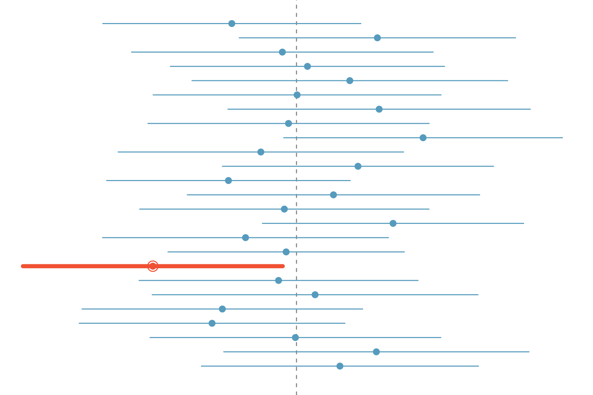

<style>
citation {
  font-size: 4px;
}
</style>

<!--  Version 1.0-0

      This version of the slides is adapted from Mine Çetinkaya-Rundel's lecture slides
      in .tex format for the Open Intro Statistics text, with some modifications, and
      moved to Rmd -> HTML.

      A large part of the HTML/CSS formatting is janky, and could be cleaned up. Feel free to issue a 
      pull request if you love HTML and CSS and want to fix this up.

      - wburr, Oct 17, 2018
-->

# Confidence intervals

## Why do we report confidence intervals?

* A plausible range of values for the population parameter is called a **confidence interval**.
* Using only a sample statistic to estimate a parameter is like **fishing with a spear** in a murky lake, and using a confidence interval is like **fishing with a net**.
* We can throw a spear where we saw a fish but we will probably miss. If we toss a net in that area, we have a good chance of catching the fish.

So the analogy: if we report a point estimate, we probably won't hit the exact population parameter. If we report a range of plausible values we have a good shot at capturing the parameter. 

## Average number of exclusive relationships

A random sample of 50 college students were asked how many exclusive relationships they have been in so far. This sample yielded a mean of 3.2 and a standard deviation of 1.74. Estimate the true average number of exclusive relationships using this sample.

$$
\bar{x} = 3.2 \qquad s = 1.74
$$

<span style="font-color: blue;">
The approximate 95% confidence interval is defined as 
$$
\text{point estimate} \pm 2 \times \text{SE}
$$
</span>

$$
SE = \frac{s}{\sqrt{n}} = \frac{1.74}{\sqrt{50}} \approx 0.25
$$

## Average number of exclusive relationships

A random sample of 50 college students were asked how many exclusive relationships they have been in so far. This sample yielded a mean of 3.2 and a standard deviation of 1.74. Estimate the true average number of exclusive relationships using this sample.

$$
\bar{x} = 3.2 \qquad s = 1.74
$$

$$
\begin{eqnarray*}
\bar{x} \pm 2 \times SE &=& 3.2 \pm 2 \times 0.25 \\
&=& (3.2 - 0.5, 3.2 + 0.5) \\
&=& (2.7, 3.7)
\end{eqnarray*}
$$

## Practice

Which of the following is the correct interpretation of this confidence interval?

We are 95% confident that

* the average number of exclusive relationships college students in this sample have been in is between 2.7 and 3.7.
* college students on average have been in between 2.7 and 3.7 exclusive relationships.
* a randomly chosen college student has been in 2.7 to 3.7 exclusive relationships.
* 95% of college students have been in 2.7 to 3.7 exclusive relationships.

## Practice

Which of the following is the correct interpretation of this confidence interval?

We are 95% confident that

* the average number of exclusive relationships college students in this sample have been in is between 2.7 and 3.7.
* <span id="highlight">college students on average have been in between 2.7 and 3.7 exclusive relationships.</span>
* a randomly chosen college student has been in 2.7 to 3.7 exclusive relationships.
* 95% of college students have been in 2.7 to 3.7 exclusive relationships.

## A more accurate interval

**Confidence interval, a general formula**
$$
\text{point estimate} \pm z^\star \cdot SE
$$

Conditions when the point estimate = $\bar{x}$:

* **Independence:** Observations in the sample must be independent
    - random sample/assignment
    -  if sampling without replacement, $n <$ 10% of population
* **Sample size / skew:** $n \ge 30$ and population distribution should not be extremely skewed

**Note:** We will discuss working with samples where $n < 30$ later.


## Capturing the population parameter

What does 95\% confident mean?

* Suppose we took many samples and built a confidence interval from each sample using the equation $\text{point estimate} \pm 2 \cdot SE$.
* Then about 95% of those intervals would contain the true population $\mu$.

<div style="display: inline-block; float: left; width: 50%;">
* The figure to the right shows this process with 25 samples, where 24 of the resulting confidence intervals contain the true average number of exclusive relationships, and one does not.
</div>
<div style="display: inline-block; float: right; width: 50%; text-align: right;">

</div>

## Width of an interval

If we want to be more certain that we capture the population parameter, *i.e.*, increase our confidence level, should we use a wider interval or a smaller interval?

## Width of an interval

If we want to be more certain that we capture the population parameter, i.e. increase our confidence level, should we use a wider interval or a smaller interval?

**A wider interval.**

## Width of an interval

If we want to be more certain that we capture the population parameter, i.e. increase our confidence level, should we use a wider interval or a smaller interval?

**A wider interval.**

Can you see any drawbacks to using a wider interval?

## Width of an interval

If we want to be more certain that we capture the population parameter, i.e. increase our confidence level, should we use a wider interval or a smaller interval?

**A wider interval.**

Can you see any drawbacks to using a wider interval?

<center>

</center>

**If the interval is too wide it may not be very informative.**

<span style = "font-size: 10px; font-style: oblique;">http://web.as.uky.edu/statistics/users/earo227/misc/garfield_weather.gif</span>

## Changing the confidence level

$$
\text{point estimate} \pm z^\star \cdot SE
$$

* In a confidence interval, $z^\star \cdot SE$ is called the **margin of error** (ME), and for a given sample, the margin of error changes as the confidence level changes.
* In order to change the confidence level we need to adjust $z^\star$ in the above formula.
* Commonly used confidence levels in practice are 90%, 95%, 98%, and 99%.
* For a 95% confidence interval, $z^\star = 1.96$.
* However, using the standard normal ($z$) distribution, it is possible to find the appropriate $z^\star$ for any confidence level.

## Practice 

Which of the below Z scores is the appropriate $z^\star$ when calculating a 98% confidence interval?

<div style="display: inline-block; float: left; width: 50%;">
* $Z = 2.05$
* $Z = 1.96$
* $Z = 2.33$
* $Z = -2.33$
* $Z = -1.65$
</div>
<div style="display: inline-block; float: right; width: 50%; text-align: right;">
<center>
<!---->
</center>
</div>

## Practice 

Which of the below Z scores is the appropriate $z^\star$ when calculating a 98% confidence interval?

<div style="display: inline-block; float: left; width: 50%;">
* $Z = 2.05$
* $Z = 1.96$
* $Z = 2.33$
* $Z = -2.33$
* $Z = -1.65$
</div>
<div style="display: inline-block; float: right; width: 50%; text-align: right;">
<center>

</center>
</div>

# Testing Hypotheses: CIs

## Testing hypotheses using confidence intervals

Earlier we calculated a 95% confidence interval for the average number of exclusive relationships college students have been in to be (2.7, 3.7). Based on this confidence interval, do these data support the hypothesis that college students on average have been in more than 3 exclusive relationships?

* The associated hypotheses are:
    - $H_0$: $\mu = 3$: College students have been in 3 exclusive relationships, on average
    - $H_A$: $\mu > 3$: College students have been in more than 3 exclusive relationships, on average

## Testing hypotheses using confidence intervals

Earlier we calculated a 95% confidence interval for the average number of exclusive relationships college students have been in to be (2.7, 3.7). Based on this confidence interval, do these data support the hypothesis that college students on average have been in more than 3 exclusive relationships?

* The associated hypotheses are:
    - $H_0$: $\mu = 3$: College students have been in 3 exclusive relationships, on average
    - $H_A$: $\mu > 3$: College students have been in more than 3 exclusive relationships, on average
* Since the null value is included in the interval, we do not reject the null hypothesis in favor of the alternative.
* This is a quick-and-dirty approach for hypothesis testing. However it doesn't tell us the likelihood of certain outcomes under the null hypothesis, i.e., the *p*-value, based on which we can make a decision on the hypotheses.

## Summary

Confidence intervals for the population mean $\mu$ from large samples have the form
$$
\bar{x} \pm \text{ME} = \bar{x} \pm z^\star \cdot \text{SE}
$$
and explicitly, the Standard Error, $\text{SE}$, is
$$
\text{SE} = \frac{\sigma}{\sqrt{n}}.
$$

# Examples

## Example 1

Maple Leaf receives a large shipment of turkeys carcasses for packaging and sale, and the 
manager wants to determine if the true mean weight of the turkeys meets their requirement of 3.7 kg per turkey, on average.
A random sample of 36 turkeys yields a sample mean weight of 3.6 kg., with a sample standard deviation of 0.61 kg. Does the shipment satisfy Maple Leaf’s requirement? (Note: it would be very costly to reject a shipment incorrectly.) 
Complete a test of hypothesis using a confidence interval.

## Example 1

Key information:

* $\mu = 3.7$
* $\bar{x} = 3.6$
* $s = 0.61$
* $n = 36$

## Example 1: the CI

Compute the confidence interval:

$$
\bar{x} \pm z^\star \cdot \frac{s}{\sqrt{n}} = 3.6 \pm z^\star \cdot \frac{0.61}{\sqrt{36}}
$$
What is $z^\star$? The question says that a "mistake will be very costly" - so we really don't want to make a mistake! This 
corresponds to a high degree of confidence, so let's say 99%, which is $\alpha/2 = 0.005$. Then:
```{r}
qnorm(1 - 0.01/2)
```

## Example 1: finishing

$$
\bar{x} \pm z^\star \cdot \frac{s}{\sqrt{n}} = 3.6 \pm 2.576 \cdot \frac{0.61}{\sqrt{36}} = (3.3381, 3.8619)
$$

Since this confidence interval **includes** the null hypothesis of 3.7, we **fail to reject the null hypothesis**, and this shipment probably meets the company's requirement.

## Number of university applications

A survey asked how many universities students applied to, and 206 students responded to this question. This sample yielded an average of 9.7 universitiy applications with a standard deviation of 7. A government website states that counselors recommend students apply to roughly 8 universities.  Do these data provide convincing evidence that the average number of universities all Trent students apply to is *higher* than recommended?

## Setting the hypotheses

* The **parameter of interest** is the average number of schools applied to by **all** Trent students.
* There may be two explanations why our sample mean is higher than the recommended 8 schools.
    - The true population mean is different.
    - The true population mean is 8, and the difference between the true population mean and the sample mean is simply due to natural sampling variability.

## Setting the hypotheses (ctd.)

* We start with the assumption the average number of schools Trent students apply to is 8 (as recommended)
$$
H_0:~\mu = 8
$$
* We test the claim that the average number of schools Trent students apply to is greater than 8
$$
H_A:~\mu > 8
$$

## Number of university applications - conditions

Which of the following is *not* a condition that needs to be met to proceed with this hypothesis test?

* Students in the sample should be independent of each other with respect to how many schools they applied to.
* Sampling should have been done randomly.
* The sample size should be less than 10% of the population of all Trent students.
* There should be at least 10 successes and 10 failures in the sample.
* The distribution of the number of schools students apply to should not be extremely skewed.

## Using a CI

What's the key information again?

* $n = 206$
* $\bar{x} = 9.7$
* $s = 7$
* $\mu = 8$

$$
\bar{x} \pm z^\star \cdot \frac{s}{\sqrt{n}} = 9.7 \pm 1.96 \cdot \frac{7}{\sqrt{206}} = (8.744, 10.656)
$$

So, since $8$ is **not** included in this interval, we **do have evidence to reject the null**, and we can conclude that it appears that
Trent students are applying to too many universities, based on the standard recommendation.
